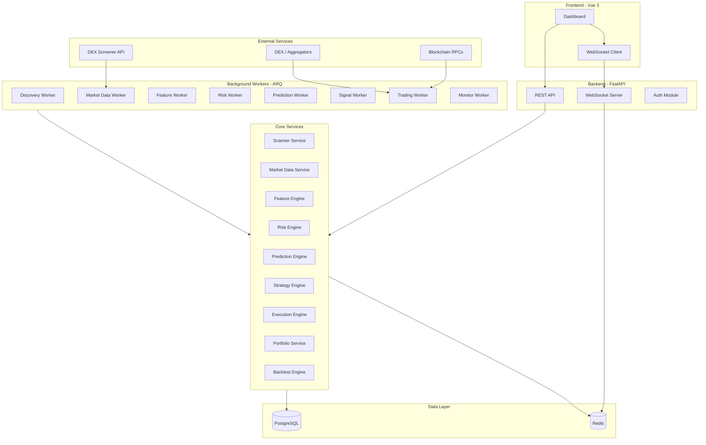
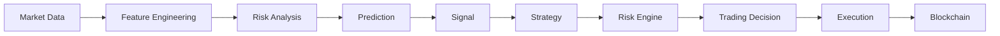
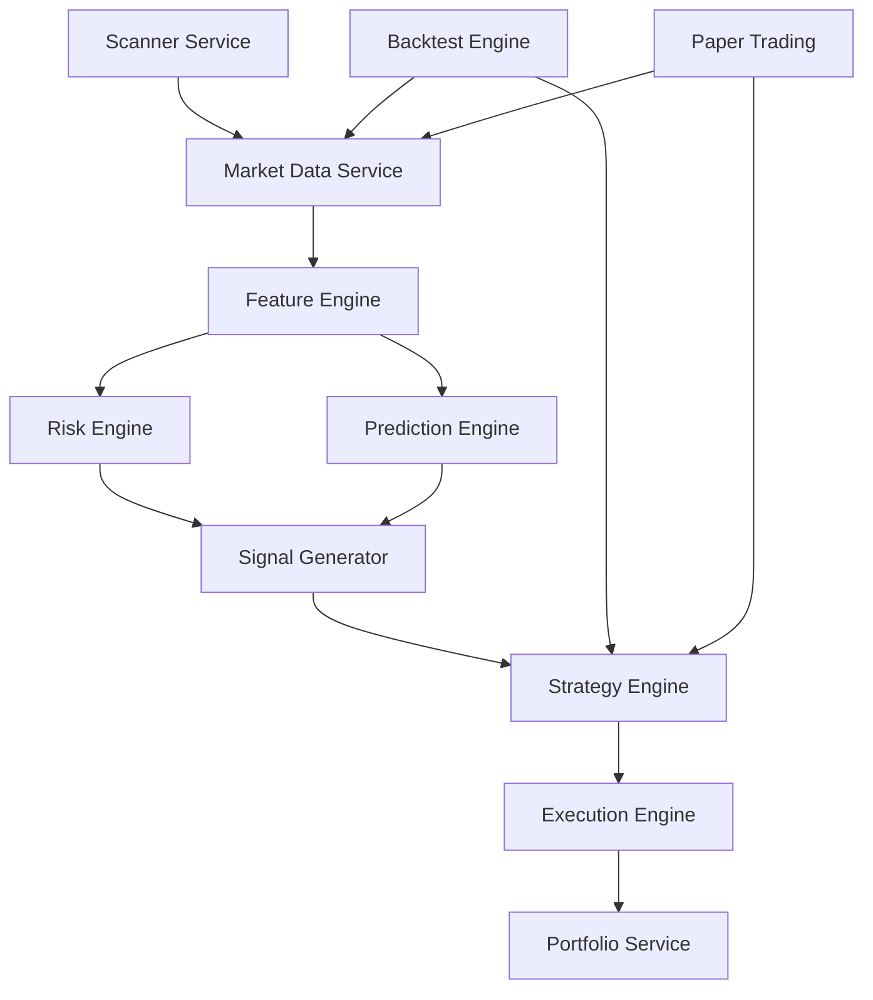
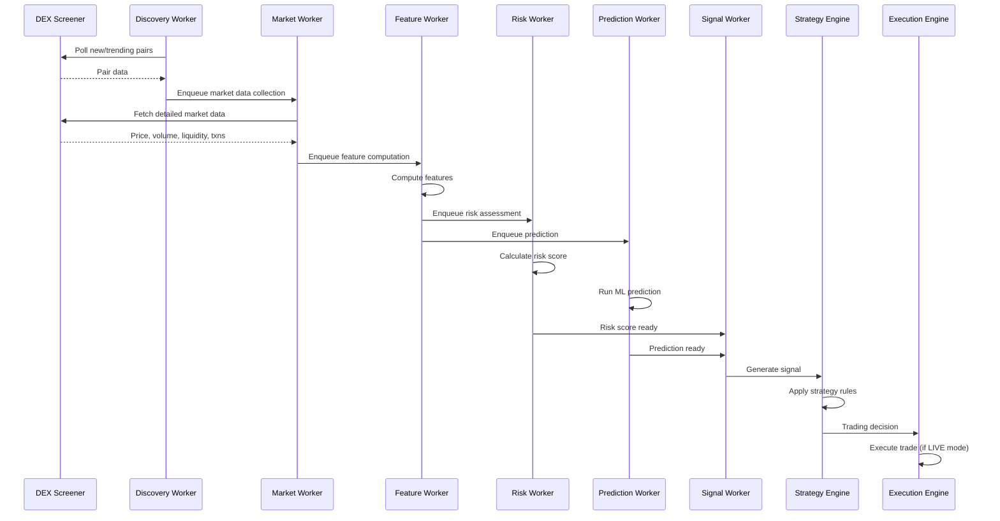
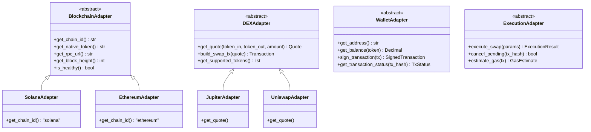
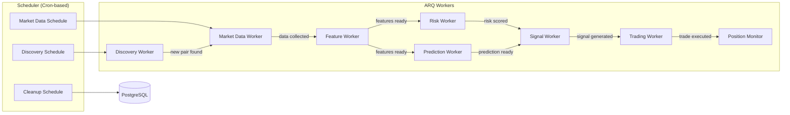
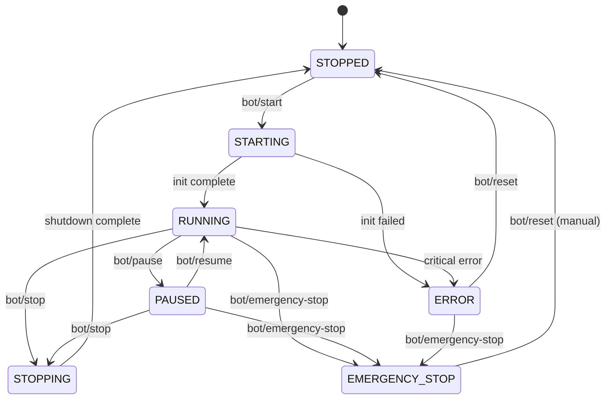
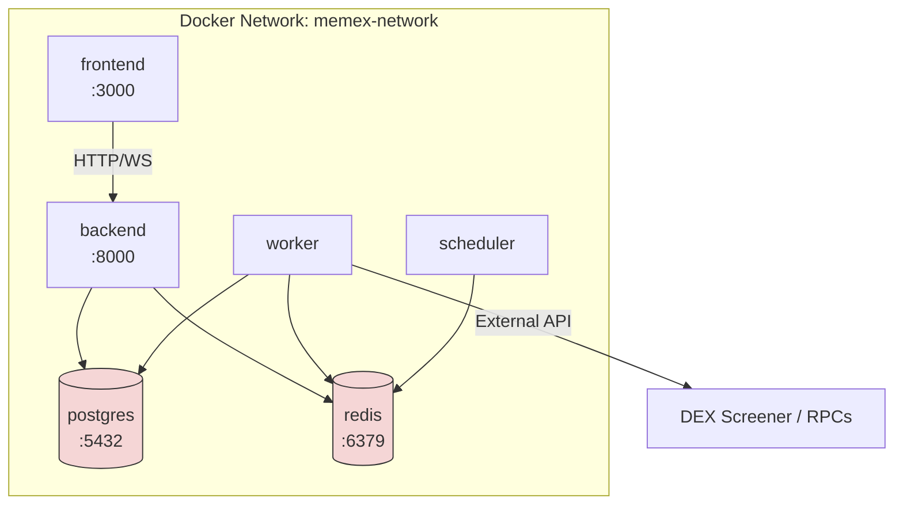

# MemeX — System Architecture

> Dokumen ini menjelaskan arsitektur keseluruhan sistem MemeX, termasuk component diagram, design decisions, dan abstraction layers.

---

## Table of Contents

- [1. Architecture Overview](#1-architecture-overview)
- [2. Core Principle](#2-core-principle)
- [3. Component Architecture](#3-component-architecture)
- [4. Data Flow](#4-data-flow)
- [5. Multi-Chain Abstraction](#5-multi-chain-abstraction)
- [6. Worker Architecture](#6-worker-architecture)
- [7. Bot State Machine](#7-bot-state-machine)
- [8. Docker Container Architecture](#8-docker-container-architecture)
- [9. Decision Records](#9-decision-records)

---

## 1. Architecture Overview



---

## 2. Core Principle

### Data ≠ Signal ≠ Decision ≠ Execution

Setiap tahap dalam pipeline trading adalah **terpisah dan independen**:



**Mengapa pemisahan ini penting:**

| Layer | Responsibility | Contoh |
|-------|---------------|--------|
| Market Data | Collect & normalize raw data | Harga, volume, liquidity dari DEX Screener |
| Feature Engineering | Transform raw → computed features | `return_5m`, `volume_spike`, `buy_pressure` |
| Risk Analysis | Assess token-level risk | Liquidity risk, rug pull risk |
| Prediction | Estimate probability of outcome | P(price ≥ 10% in 15min) = 0.72 |
| Signal | Determine action recommendation | BUY / SELL / HOLD |
| Strategy | Apply strategy rules & filters | Confidence ≥ 0.7 AND risk_score ≤ 40 |
| Risk Engine | Portfolio-level risk check | Max positions, max daily loss |
| Trading Decision | Final go/no-go | BUY 0.01 SOL with reasons |
| Execution | Construct & send transaction | Swap via Jupiter on Solana |

**Setiap layer dapat di-replace tanpa mengubah layer lain.** Misalnya:
- Ganti ML model → tidak perlu ubah strategy/execution
- Ganti blockchain → tidak perlu ubah prediction/strategy
- Ganti strategy → tidak perlu ubah data pipeline

---

## 3. Component Architecture

### 3.1 Layered Architecture

```
┌─────────────────────────────────────────────────┐
│                  Presentation Layer              │
│              Vue 3 + TypeScript + Vite           │
├─────────────────────────────────────────────────┤
│                    API Layer                      │
│              FastAPI REST + WebSocket             │
├─────────────────────────────────────────────────┤
│                  Service Layer                    │
│  Scanner │ Market │ Risk │ Prediction │ Strategy  │
│  Execution │ Portfolio │ Backtest │ Paper Trading │
├─────────────────────────────────────────────────┤
│                 Adapter Layer                     │
│  DEXScreenerAdapter │ BlockchainAdapter           │
│  DEXAdapter │ WalletAdapter │ ExecutionAdapter     │
├─────────────────────────────────────────────────┤
│                Worker Layer                       │
│          ARQ Workers + Scheduler                  │
├─────────────────────────────────────────────────┤
│                  Data Layer                       │
│           PostgreSQL │ Redis                      │
└─────────────────────────────────────────────────┘
```

### 3.2 Service Dependencies



---

## 4. Data Flow

### 4.1 Discovery → Trading Pipeline



### 4.2 Market Data Pipeline

```
External API (DEX Screener)
     ↓
┌─────────────┐
│  Collector   │  HTTP client with rate limiting
└──────┬──────┘
       ↓
┌─────────────┐
│  Normalizer  │  Standardize data format
└──────┬──────┘
       ↓
┌─────────────┐
│  Validator   │  Data quality checks
└──────┬──────┘
       ↓
┌──────┴──────┐
│    Redis     │  Current state cache (TTL-based)
└──────┬──────┘
       ↓
┌─────────────┐
│ PostgreSQL   │  Historical storage (time-series)
└─────────────┘
```

---

## 5. Multi-Chain Abstraction

### 5.1 Adapter Pattern

Sistem menggunakan **Adapter Pattern** agar penambahan blockchain baru tidak mengubah core trading engine.



### 5.2 Target Chains

| Chain | Status | Priority | DEX Example |
|-------|--------|----------|-------------|
| Solana | `[TBD]` — First candidate | High | Jupiter, Raydium |
| Ethereum | Planned | Medium | Uniswap |
| Base | Planned | Medium | Aerodrome |
| BSC | Planned | Low | PancakeSwap |
| Arbitrum | Planned | Low | Camelot |
| Polygon | Planned | Low | QuickSwap |

> [!IMPORTANT]
> **[DECISION REQUIRED]**: Chain mana yang akan diimplementasikan pertama? Rekomendasi: **Solana**, karena sebagian besar meme coin activity saat ini terkonsentrasi di Solana.

### 5.3 Design Principle

> Menambahkan blockchain baru **tidak boleh** mengubah core trading engine.

Yang perlu dilakukan untuk menambah chain baru:
1. Implement `BlockchainAdapter` untuk chain tersebut
2. Implement `DEXAdapter` untuk DEX di chain tersebut
3. Implement `WalletAdapter` untuk wallet chain tersebut
4. Register adapter di configuration
5. **Tidak perlu mengubah**: Scanner, Feature Engine, Risk Engine, Prediction, Strategy, Backtesting

---

## 6. Worker Architecture

### 6.1 Worker Types



### 6.2 Worker Specifications

| Worker | Trigger | Frequency | Concurrency | Queue Priority |
|--------|---------|-----------|-------------|----------------|
| Discovery | Scheduler | Every 30s | 1 | Normal |
| Market Data | Discovery / Scheduler | Every 10s per watched token | 3 | High |
| Feature | Market Data completion | On data arrival | 2 | Normal |
| Risk | Feature completion | On feature arrival | 2 | Normal |
| Prediction | Feature completion | On feature arrival | 1 | Normal |
| Signal | Risk + Prediction ready | On both ready | 1 | High |
| Trading | Signal generation | On signal | 1 | Critical |
| Position Monitor | Scheduler | Every 5s per position | 2 | High |

### 6.3 Worker Communication

Workers berkomunikasi melalui **Redis** menggunakan mekanisme:

1. **Job Queue** — ARQ job enqueue untuk sequential processing
2. **Pub/Sub** — Untuk event notification (signal generated, trade executed)
3. **Cache** — Shared state (current prices, feature cache)

---

## 7. Bot State Machine

### 7.1 States

| State | Deskripsi |
|-------|-----------|
| `STOPPED` | Bot tidak berjalan, semua workers idle |
| `STARTING` | Bot sedang melakukan inisialisasi |
| `RUNNING` | Bot aktif, semua workers berjalan |
| `PAUSED` | Workers berjalan tapi tidak membuka posisi baru |
| `STOPPING` | Bot sedang graceful shutdown |
| `ERROR` | Bot mengalami error, perlu intervention |
| `EMERGENCY_STOP` | Kill switch aktif, semua aktivitas dihentikan |

### 7.2 State Transitions



### 7.3 Transition Rules

| From | To | Trigger | Action |
|------|----|---------|--------|
| STOPPED → STARTING | `POST /api/bot/start` | Initialize workers, validate config, check connections |
| STARTING → RUNNING | Auto | All workers healthy, data pipeline active |
| STARTING → ERROR | Auto | Connection failure, invalid config |
| RUNNING → PAUSED | `POST /api/bot/pause` | Stop opening new positions, keep monitoring existing |
| RUNNING → STOPPING | `POST /api/bot/stop` | Graceful shutdown, complete pending operations |
| RUNNING → EMERGENCY_STOP | `POST /api/bot/emergency-stop` | Cancel all pending, stop all new, alert |
| PAUSED → RUNNING | `POST /api/bot/start` (resume) | Resume normal operation |
| ERROR → STOPPED | `POST /api/bot/reset` | Clear error state, stop all workers |
| EMERGENCY_STOP → STOPPED | `POST /api/bot/reset` | Manual reset only, require confirmation |

### 7.4 Emergency Stop (Kill Switch)

```
KILL SWITCH ACTIVATED
     ↓
1. Stop all new trade signals
     ↓
2. Cancel all pending transactions
     ↓
3. Continue monitoring existing positions (read-only)
     ↓
4. Send alert notification
     ↓
5. Log event to audit trail
     ↓
6. Wait for manual reset
```

---

## 8. Docker Container Architecture

### 8.1 Containers



### 8.2 Container Responsibilities

| Container | Image Base | Responsibility | Ports |
|-----------|-----------|----------------|-------|
| `frontend` | node:20-alpine | Vue 3 app (nginx in production) | 3000 |
| `backend` | python:3.12-slim | FastAPI app, REST API, WebSocket | 8000 |
| `worker` | python:3.12-slim | ARQ workers (discovery, market, feature, risk, prediction, signal, trading, monitor) | — |
| `scheduler` | python:3.12-slim | Cron-like scheduler yang enqueue jobs ke ARQ | — |
| `postgres` | postgres:16 | Database | 5432 |
| `redis` | redis:7-alpine | Cache, queue, pub/sub | 6379 |

### 8.3 Volume Mounts

| Container | Volume | Purpose |
|-----------|--------|---------|
| postgres | `pgdata:/var/lib/postgresql/data` | Persistent database |
| redis | `redis-data:/data` | Persistent cache (optional) |
| backend | `./backend:/app` | Development hot reload |
| frontend | `./frontend:/app` | Development hot reload |
| ml | `./ml/models:/app/models` | Shared ML model artifacts |

---

## 9. Decision Records

### ADR-001: Background Processing — ARQ vs Celery

**Context:** Sistem membutuhkan background processing untuk workers (discovery, market data, dll).

**Options:**

| Criteria | Celery | ARQ | asyncio workers |
|----------|--------|-----|-----------------|
| Async native | ❌ (gevent/eventlet) | ✅ (asyncio native) | ✅ |
| Dependencies | Heavy (kombu, billiard) | Minimal (arq only) | None |
| Redis support | Via broker | Native | Manual |
| Job scheduling | ✅ (celery-beat) | ✅ (cron jobs) | Manual |
| Job retry | ✅ | ✅ | Manual |
| Monitoring | Flower | Dashboard / logs | Manual |
| Learning curve | Medium | Low | Low |
| Community | Very large | Small-medium | N/A |

**Decision:** **ARQ**

**Rationale:**
1. Seluruh backend sudah berbasis `asyncio` (FastAPI). ARQ terintegrasi natural tanpa perlu threading compatibility layer.
2. Dependency footprint minimal — hanya `arq` package dan Redis.
3. Job retry, scheduling, dan concurrency control sudah built-in.
4. Untuk skala MemeX (single instance, bukan distributed cluster), ARQ sudah lebih dari cukup.
5. Jika di masa depan perlu scaling horizontal, migrasi ke Celery dimungkinkan karena worker logic terpisah dari queue mechanism.

**Risk:** Jika sistem perlu horizontal scaling ke banyak nodes, ARQ mungkin kurang mature dibanding Celery. Mitigasi: isolasi worker logic dari queue layer agar migrasi mudah.

---

### ADR-002: Realtime Communication — WebSocket vs SSE

**Context:** Dashboard membutuhkan realtime updates (price, signals, positions).

**Options:**

| Criteria | WebSocket | SSE |
|----------|-----------|-----|
| Bi-directional | ✅ | ❌ (server → client only) |
| Browser support | ✅ | ✅ |
| Auto-reconnect | Manual | Built-in |
| Complexity | Medium | Low |
| Scalability | Connection pool needed | Simpler |

**Decision:** **WebSocket** (primary) + **SSE** (fallback)

**Rationale:**
1. Dashboard memerlukan bi-directional communication (subscribe/unsubscribe channels).
2. WebSocket lebih efisien untuk high-frequency updates (price changes).
3. SSE sebagai fallback jika WebSocket unavailable.

---

### ADR-003: Data Source — DEX Screener Only vs Multi-Source

**Context:** Apakah cukup menggunakan DEX Screener saja atau perlu multiple data sources?

**Decision:** **DEX Screener sebagai primary source, dengan abstraction untuk future multi-source.**

**Rationale:**
1. DEX Screener menyediakan data agregat dari 70+ DEX di 30+ chain — cukup komprehensif.
2. Behavioral features (whale activity, holder growth) membutuhkan on-chain data yang **tidak** tersedia di DEX Screener. Ini ditandai `[TBD]` dan akan diimplementasikan melalui adapter tambahan.
3. Abstraction layer (`DataSourceAdapter`) memungkinkan penambahan sumber data baru tanpa mengubah pipeline.

**Assumption:**
- DEX Screener API tetap free / accessible untuk use case ini.
- Rate limit 60-300 req/min cukup untuk single-instance deployment.
