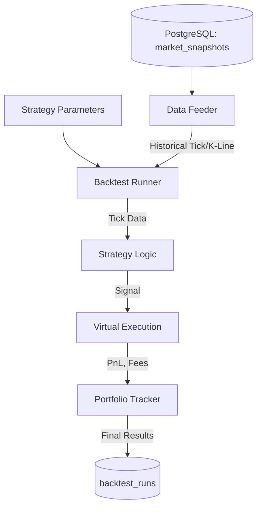

# MemeX — Backtesting Engine

> Dokumen ini menjelaskan rancangan Backtesting Engine untuk mengevaluasi strategi trading menggunakan data historis tanpa merisikokan modal sungguhan.

---

## Table of Contents

- [1. Overview](#1-overview)
- [2. Engine Architecture](#2-engine-architecture)
- [3. Historical Data Source](#3-historical-data-source)
- [4. Simulation Logic](#4-simulation-logic)
- [5. Slippage & Fee Modeling](#5-slippage--fee-modeling)
- [6. Performance Metrics](#6-performance-metrics)

---

## 1. Overview

Backtesting Engine memungkinkan developer dan user untuk menguji strategi (aturan masuk/keluar, risk parameter, ML thresholds) terhadap data market masa lalu. Tujuannya adalah untuk membuktikan apakah suatu strategi *profitable* secara statistik sebelum dijalankan di live market.

**Tantangan di Meme Coin:** Backtesting aset kripto biasa relatif mudah. Namun di meme coin, masalah terbesar adalah *illiquidity* dan *slippage*. Backtesting engine ini dirancang khusus untuk mensimulasikan kondisi pasar meme coin yang brutal.

---

## 2. Engine Architecture



---

## 3. Historical Data Source

Data yang digunakan untuk backtesting berasal dari tabel `market_snapshots` (resolusi 5s/10s) atau `token_metrics` (resolusi 1m).

- **High-Frequency Testing (Scalping):** Membutuhkan raw `market_snapshots` karena fluktuasi dalam 1 menit sangat drastis.
- **Low-Frequency Testing (Swing):** Dapat menggunakan `token_metrics` 1-minute OHLCV agar lebih cepat.

> [!NOTE]
> Backtester menggunakan desain **Event-Driven**. Sistem akan meng-iterate waktu (misal: setiap 1 menit), memberikan *market state* ke strategi, lalu mengevaluasi apakah ada sinyal yang dihasilkan.

---

## 4. Simulation Logic

Setiap Virtual Order (simulasi) harus melewati kondisi ini:

1. **Trigger:** Sinyal BUY/SELL muncul.
2. **Execution Price:** Harga yang didapat bukan sekadar harga `close` saat itu, melainkan harga setelah disimulasikan slippage.
3. **Liquidity Check:** Jika ukuran posisi (misal $1000) lebih besar dari 10% total likuiditas pair tersebut di momen tersebut, trade dianggap GAGAL (atau disimulasikan mengalami slippage masif hingga 50%).

---

## 5. Slippage & Fee Modeling

Untuk menghindari hasil backtest yang "terlalu bagus" (overfitting pada ilusi likuiditas), model slippage diterapkan:

**Fee Model:**
- Trading Fee (DEX): 0.3%
- Network Fee (Gas): $0.05 (Solana) atau $5.00 (Base) — configurable.

**Slippage Model:**
Makin besar order relatif terhadap liquidity, makin besar slippage-nya.
```text
Slippage % = Base_Slippage (1%) + (Order_Size_USD / Available_Liquidity_USD) * Impact_Factor
```
*(Impact_Factor diset tinggi untuk mencerminkan depth yang tipis)*

---

## 6. Performance Metrics

Hasil backtest disimpan di tabel `backtest_runs` dan memiliki metrik berikut:

| Metric | Deskripsi | Target (Rule of Thumb) |
|--------|-----------|------------------------|
| **Net PnL** | Total keuntungan/kerugian akhir dalam USD. | > 0 |
| **Win Rate** | (Winning Trades / Total Trades) * 100%. | > 40% (Jika Reward/Risk tinggi) |
| **Profit Factor** | Gross Profit / Gross Loss. | > 1.5 |
| **Max Drawdown** | Penurunan saldo terbesar dari puncak tertinggi ke lembah terendah. | < 20% |
| **Sharpe Ratio** | Risk-adjusted return. | > 1.0 |
| **Average Win/Loss** | Rata-rata nominal per trade menang vs kalah. | Avg Win > 2x Avg Loss |
| **Expectancy** | (Win Rate * Avg Win) - (Loss Rate * Avg Loss) | > 0 |

Dashboard web akan menampilkan grafik equity curve berdasarkan metrik ini.
