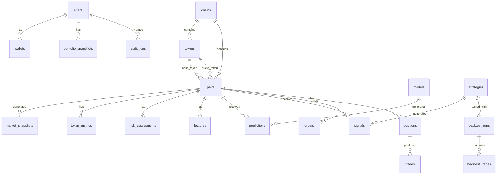

# MemeX — Database Design

> Dokumen ini menjelaskan ERD konseptual, schema design, indexing strategy, dan retention policy untuk PostgreSQL.

---

## Table of Contents

- [1. ERD Overview](#1-erd-overview)
- [2. Table Specifications](#2-table-specifications)
- [3. Indexing Strategy](#3-indexing-strategy)
- [4. Partitioning Strategy](#4-partitioning-strategy)
- [5. Retention Policy](#5-retention-policy)

---

## 1. ERD Overview



---

## 2. Table Specifications

### 2.1 `users`

**Purpose:** Operator/admin accounts yang mengakses dashboard dan mengonfigurasi bot.

| Column | Type | Constraint | Deskripsi |
|--------|------|-----------|-----------|
| `id` | UUID | PK | Unique user identifier |
| `username` | VARCHAR(50) | UNIQUE, NOT NULL | Login username |
| `email` | VARCHAR(255) | UNIQUE, NOT NULL | Email address |
| `password_hash` | VARCHAR(255) | NOT NULL | Bcrypt hashed password |
| `is_active` | BOOLEAN | DEFAULT true | Account active status |
| `is_admin` | BOOLEAN | DEFAULT false | Admin privileges |
| `settings` | JSONB | DEFAULT '{}' | User preferences & config |
| `created_at` | TIMESTAMPTZ | NOT NULL | Account creation time |
| `updated_at` | TIMESTAMPTZ | NOT NULL | Last update time |

**Indexes:** `idx_users_username`, `idx_users_email`
**Retention:** Permanent

---

### 2.2 `wallets`

**Purpose:** Wallet configurations per chain. Private key TIDAK disimpan di database.

| Column | Type | Constraint | Deskripsi |
|--------|------|-----------|-----------|
| `id` | UUID | PK | Wallet identifier |
| `user_id` | UUID | FK → users | Owner |
| `chain_id` | VARCHAR(20) | FK → chains | Blockchain |
| `address` | VARCHAR(255) | NOT NULL | Public wallet address |
| `label` | VARCHAR(100) | | Human-readable name |
| `is_active` | BOOLEAN | DEFAULT true | Active for trading |
| `max_trade_amount` | DECIMAL(20,8) | | Maximum per trade (native token) |
| `daily_loss_limit` | DECIMAL(20,8) | | Daily loss limit (USD) |
| `created_at` | TIMESTAMPTZ | NOT NULL | |
| `updated_at` | TIMESTAMPTZ | NOT NULL | |

> [!CAUTION]
> **Private keys TIDAK disimpan di database.** Private keys dikelola melalui encrypted environment variables atau external secret manager. Lihat [wallet-security.md](wallet-security.md).

**Indexes:** `idx_wallets_user_chain` (user_id, chain_id)
**Retention:** Permanent

---

### 2.3 `chains`

**Purpose:** Supported blockchain registry.

| Column | Type | Constraint | Deskripsi |
|--------|------|-----------|-----------|
| `id` | VARCHAR(20) | PK | Chain identifier (e.g., "solana", "ethereum") |
| `name` | VARCHAR(100) | NOT NULL | Display name |
| `native_token` | VARCHAR(10) | NOT NULL | Native token symbol |
| `rpc_url` | VARCHAR(500) | | Default RPC endpoint |
| `explorer_url` | VARCHAR(500) | | Block explorer URL |
| `is_active` | BOOLEAN | DEFAULT false | Enabled for trading |
| `config` | JSONB | DEFAULT '{}' | Chain-specific configuration |
| `created_at` | TIMESTAMPTZ | NOT NULL | |

**Retention:** Permanent

---

### 2.4 `tokens`

**Purpose:** Registry semua token yang pernah di-discover.

| Column | Type | Constraint | Deskripsi |
|--------|------|-----------|-----------|
| `id` | UUID | PK | Token identifier |
| `chain_id` | VARCHAR(20) | FK → chains, NOT NULL | Blockchain |
| `address` | VARCHAR(255) | NOT NULL | Token contract address |
| `name` | VARCHAR(255) | | Token name |
| `symbol` | VARCHAR(50) | | Token symbol |
| `decimals` | INTEGER | | Token decimals |
| `image_url` | VARCHAR(500) | | Token icon URL |
| `is_watched` | BOOLEAN | DEFAULT false | Actively monitored |
| `is_blacklisted` | BOOLEAN | DEFAULT false | Blacklisted (scam/rug) |
| `first_seen_at` | TIMESTAMPTZ | NOT NULL | First discovery time |
| `metadata` | JSONB | DEFAULT '{}' | Additional metadata (websites, socials) |
| `created_at` | TIMESTAMPTZ | NOT NULL | |
| `updated_at` | TIMESTAMPTZ | NOT NULL | |

**Indexes:** `idx_tokens_chain_address` UNIQUE (chain_id, address), `idx_tokens_watched` (is_watched) WHERE is_watched = true
**Retention:** Permanent

---

### 2.5 `pairs`

**Purpose:** Trading pairs dari DEX.

| Column | Type | Constraint | Deskripsi |
|--------|------|-----------|-----------|
| `id` | UUID | PK | Pair identifier |
| `chain_id` | VARCHAR(20) | FK → chains, NOT NULL | Blockchain |
| `dex_id` | VARCHAR(50) | NOT NULL | DEX identifier |
| `pair_address` | VARCHAR(255) | NOT NULL | Pair contract address |
| `base_token_id` | UUID | FK → tokens | Base token |
| `quote_token_id` | UUID | FK → tokens | Quote token |
| `url` | VARCHAR(500) | | DEX Screener URL |
| `is_active` | BOOLEAN | DEFAULT true | Still trading |
| `pair_created_at` | TIMESTAMPTZ | | Pair creation on-chain |
| `created_at` | TIMESTAMPTZ | NOT NULL | First recorded |
| `updated_at` | TIMESTAMPTZ | NOT NULL | |

**Indexes:** `idx_pairs_chain_address` UNIQUE (chain_id, pair_address), `idx_pairs_base_token` (base_token_id), `idx_pairs_active` (is_active)
**Retention:** Permanent

---

### 2.6 `market_snapshots`

**Purpose:** Time-series market data snapshots. **Tabel terbesar — partitioned by date.**

| Column | Type | Constraint | Deskripsi |
|--------|------|-----------|-----------|
| `id` | BIGSERIAL | PK | Auto-increment ID |
| `pair_id` | UUID | FK → pairs, NOT NULL | Trading pair |
| `price_usd` | DECIMAL(30,18) | NOT NULL | Price in USD |
| `price_native` | DECIMAL(30,18) | | Price in native token |
| `price_change_5m` | FLOAT | | 5-min price change % |
| `price_change_1h` | FLOAT | | 1-hour price change % |
| `price_change_6h` | FLOAT | | 6-hour price change % |
| `price_change_24h` | FLOAT | | 24-hour price change % |
| `volume_5m` | DECIMAL(20,2) | | 5-min volume USD |
| `volume_1h` | DECIMAL(20,2) | | 1-hour volume USD |
| `volume_6h` | DECIMAL(20,2) | | 6-hour volume USD |
| `volume_24h` | DECIMAL(20,2) | | 24-hour volume USD |
| `buys_5m` | INTEGER | | Buy txns in 5 min |
| `sells_5m` | INTEGER | | Sell txns in 5 min |
| `buys_1h` | INTEGER | | Buy txns in 1 hour |
| `sells_1h` | INTEGER | | Sell txns in 1 hour |
| `buys_24h` | INTEGER | | Buy txns in 24 hours |
| `sells_24h` | INTEGER | | Sell txns in 24 hours |
| `liquidity_usd` | DECIMAL(20,2) | | Liquidity in USD |
| `market_cap` | DECIMAL(20,2) | | Market capitalization |
| `fdv` | DECIMAL(20,2) | | Fully diluted valuation |
| `flags` | SMALLINT | DEFAULT 0 | Bitmask: stale, anomaly, etc. |
| `snapshot_at` | TIMESTAMPTZ | NOT NULL | Snapshot timestamp |
| `created_at` | TIMESTAMPTZ | NOT NULL | Record creation |

**Indexes:** `idx_snapshots_pair_time` (pair_id, snapshot_at DESC), `idx_snapshots_time` (snapshot_at DESC)
**Partitioning:** Range by `snapshot_at` (daily partitions)
**Retention:** 7 days raw, aggregated to `token_metrics`

---

### 2.7 `token_metrics`

**Purpose:** Aggregated market data (1-min, 5-min, 1-hour OHLCV). Partitioned by date.

| Column | Type | Constraint | Deskripsi |
|--------|------|-----------|-----------|
| `id` | BIGSERIAL | PK | |
| `pair_id` | UUID | FK → pairs, NOT NULL | Trading pair |
| `interval` | VARCHAR(10) | NOT NULL | '1m', '5m', '1h' |
| `open_price` | DECIMAL(30,18) | | Open price |
| `close_price` | DECIMAL(30,18) | | Close price |
| `high_price` | DECIMAL(30,18) | | High price |
| `low_price` | DECIMAL(30,18) | | Low price |
| `total_volume` | DECIMAL(20,2) | | Total volume USD |
| `total_buys` | INTEGER | | Total buy transactions |
| `total_sells` | INTEGER | | Total sell transactions |
| `avg_liquidity` | DECIMAL(20,2) | | Average liquidity |
| `snapshot_count` | INTEGER | | Number of raw snapshots |
| `interval_start` | TIMESTAMPTZ | NOT NULL | Interval start time |
| `created_at` | TIMESTAMPTZ | NOT NULL | |

**Indexes:** `idx_metrics_pair_interval_time` UNIQUE (pair_id, interval, interval_start), `idx_metrics_interval_time` (interval, interval_start DESC)
**Partitioning:** Range by `interval_start` (monthly partitions)
**Retention:** 1m → 30 days, 5m → 90 days, 1h → permanent

---

### 2.8 `risk_assessments`

**Purpose:** Risk scoring results per token/pair.

| Column | Type | Constraint | Deskripsi |
|--------|------|-----------|-----------|
| `id` | UUID | PK | |
| `pair_id` | UUID | FK → pairs, NOT NULL | Trading pair |
| `risk_score` | INTEGER | NOT NULL | Overall risk score (0-100) |
| `risk_level` | VARCHAR(20) | NOT NULL | LOW / MEDIUM / HIGH / CRITICAL |
| `liquidity_risk` | INTEGER | | Liquidity risk score |
| `volume_risk` | INTEGER | | Volume manipulation risk |
| `price_risk` | INTEGER | | Price manipulation risk |
| `holder_risk` | INTEGER | | Holder concentration risk |
| `contract_risk` | INTEGER | | Contract risk |
| `rug_pull_risk` | INTEGER | | Rug pull probability |
| `details` | JSONB | | Detailed breakdown & reasons |
| `assessed_at` | TIMESTAMPTZ | NOT NULL | Assessment timestamp |
| `created_at` | TIMESTAMPTZ | NOT NULL | |

**Indexes:** `idx_risk_pair_time` (pair_id, assessed_at DESC)
**Retention:** 30 days

---

### 2.9 `features`

**Purpose:** Computed features untuk ML & strategy.

| Column | Type | Constraint | Deskripsi |
|--------|------|-----------|-----------|
| `id` | BIGSERIAL | PK | |
| `pair_id` | UUID | FK → pairs, NOT NULL | |
| `feature_set` | JSONB | NOT NULL | All computed features as key-value |
| `computed_at` | TIMESTAMPTZ | NOT NULL | |
| `created_at` | TIMESTAMPTZ | NOT NULL | |

**Indexes:** `idx_features_pair_time` (pair_id, computed_at DESC)
**Retention:** 30 days (raw features digunakan oleh ML training)

---

### 2.10 `models`

**Purpose:** ML model registry.

| Column | Type | Constraint | Deskripsi |
|--------|------|-----------|-----------|
| `id` | UUID | PK | |
| `name` | VARCHAR(100) | NOT NULL | Model name |
| `version` | VARCHAR(50) | NOT NULL | Model version |
| `model_type` | VARCHAR(50) | NOT NULL | e.g., lightgbm, xgboost |
| `target` | VARCHAR(100) | NOT NULL | Prediction target |
| `metrics` | JSONB | | Evaluation metrics (precision, recall, F1, etc.) |
| `hyperparameters` | JSONB | | Model hyperparameters |
| `artifact_path` | VARCHAR(500) | | Path to saved model file |
| `is_active` | BOOLEAN | DEFAULT false | Currently used for predictions |
| `trained_at` | TIMESTAMPTZ | | Training timestamp |
| `created_at` | TIMESTAMPTZ | NOT NULL | |

**Indexes:** `idx_models_active` (is_active) WHERE is_active = true
**Retention:** Permanent

---

### 2.11 `predictions`

**Purpose:** ML prediction results.

| Column | Type | Constraint | Deskripsi |
|--------|------|-----------|-----------|
| `id` | UUID | PK | |
| `pair_id` | UUID | FK → pairs, NOT NULL | |
| `model_id` | UUID | FK → models, NOT NULL | Model used |
| `target` | VARCHAR(100) | NOT NULL | e.g., 'price_up_10pct_15m' |
| `probability` | FLOAT | NOT NULL | Prediction probability (0-1) |
| `confidence` | FLOAT | | Calibrated confidence |
| `features_snapshot` | JSONB | | Input features used |
| `predicted_at` | TIMESTAMPTZ | NOT NULL | |
| `outcome` | BOOLEAN | | Actual outcome (filled later) |
| `outcome_at` | TIMESTAMPTZ | | When outcome was determined |
| `created_at` | TIMESTAMPTZ | NOT NULL | |

**Indexes:** `idx_predictions_pair_time` (pair_id, predicted_at DESC), `idx_predictions_model` (model_id)
**Retention:** 90 days

---

### 2.12 `strategies`

**Purpose:** Strategy configurations.

| Column | Type | Constraint | Deskripsi |
|--------|------|-----------|-----------|
| `id` | UUID | PK | |
| `name` | VARCHAR(100) | NOT NULL | Strategy name |
| `strategy_type` | VARCHAR(50) | NOT NULL | e.g., momentum, volume_breakout, ml_assisted |
| `parameters` | JSONB | NOT NULL | Strategy parameters |
| `is_active` | BOOLEAN | DEFAULT false | Currently active |
| `description` | TEXT | | Strategy description |
| `created_at` | TIMESTAMPTZ | NOT NULL | |
| `updated_at` | TIMESTAMPTZ | NOT NULL | |

**Retention:** Permanent

---

### 2.13 `signals`

**Purpose:** Generated trading signals.

| Column | Type | Constraint | Deskripsi |
|--------|------|-----------|-----------|
| `id` | UUID | PK | |
| `pair_id` | UUID | FK → pairs, NOT NULL | |
| `strategy_id` | UUID | FK → strategies | |
| `signal_type` | VARCHAR(10) | NOT NULL | BUY / SELL / HOLD / SKIP |
| `confidence` | FLOAT | | Signal confidence |
| `risk_score` | INTEGER | | Risk score at time of signal |
| `prediction_id` | UUID | FK → predictions | Associated prediction |
| `reasons` | JSONB | | Pro/con reasons |
| `position_size` | DECIMAL(20,8) | | Recommended position size |
| `generated_at` | TIMESTAMPTZ | NOT NULL | |
| `acted_on` | BOOLEAN | DEFAULT false | Was this signal executed |
| `created_at` | TIMESTAMPTZ | NOT NULL | |

**Indexes:** `idx_signals_pair_time` (pair_id, generated_at DESC), `idx_signals_type` (signal_type, generated_at DESC)
**Retention:** 90 days

---

### 2.14 `orders`

**Purpose:** Trade orders (both paper and live).

| Column | Type | Constraint | Deskripsi |
|--------|------|-----------|-----------|
| `id` | UUID | PK | |
| `user_id` | UUID | FK → users, NOT NULL | |
| `pair_id` | UUID | FK → pairs, NOT NULL | |
| `signal_id` | UUID | FK → signals | Originating signal |
| `order_type` | VARCHAR(10) | NOT NULL | BUY / SELL |
| `mode` | VARCHAR(10) | NOT NULL | PAPER / LIVE |
| `status` | VARCHAR(20) | NOT NULL | PENDING / SUBMITTED / CONFIRMED / FAILED / CANCELLED |
| `amount_in` | DECIMAL(20,8) | NOT NULL | Input amount |
| `token_in` | VARCHAR(255) | NOT NULL | Input token address |
| `expected_amount_out` | DECIMAL(20,8) | | Expected output |
| `actual_amount_out` | DECIMAL(20,8) | | Actual output |
| `price_at_order` | DECIMAL(30,18) | | Price at order time |
| `slippage_tolerance` | FLOAT | | Max slippage % |
| `actual_slippage` | FLOAT | | Actual slippage % |
| `tx_hash` | VARCHAR(255) | | Blockchain tx hash |
| `gas_fee` | DECIMAL(20,8) | | Gas/transaction fee |
| `error_message` | TEXT | | Error if failed |
| `retry_count` | INTEGER | DEFAULT 0 | Retry attempts |
| `ordered_at` | TIMESTAMPTZ | NOT NULL | |
| `confirmed_at` | TIMESTAMPTZ | | Confirmation time |
| `created_at` | TIMESTAMPTZ | NOT NULL | |

**Indexes:** `idx_orders_user_time` (user_id, ordered_at DESC), `idx_orders_status` (status), `idx_orders_tx` (tx_hash)
**Retention:** Permanent

---

### 2.15 `positions`

**Purpose:** Open and closed trading positions.

| Column | Type | Constraint | Deskripsi |
|--------|------|-----------|-----------|
| `id` | UUID | PK | |
| `user_id` | UUID | FK → users, NOT NULL | |
| `pair_id` | UUID | FK → pairs, NOT NULL | |
| `mode` | VARCHAR(10) | NOT NULL | PAPER / LIVE |
| `status` | VARCHAR(20) | NOT NULL | OPEN / CLOSED / LIQUIDATED |
| `entry_order_id` | UUID | FK → orders | Entry order |
| `exit_order_id` | UUID | FK → orders | Exit order (when closed) |
| `entry_price` | DECIMAL(30,18) | NOT NULL | Entry price |
| `exit_price` | DECIMAL(30,18) | | Exit price |
| `amount` | DECIMAL(20,8) | NOT NULL | Position size |
| `current_price` | DECIMAL(30,18) | | Latest price (updated periodically) |
| `unrealized_pnl` | DECIMAL(20,8) | | Unrealized PnL |
| `realized_pnl` | DECIMAL(20,8) | | Realized PnL (when closed) |
| `take_profit` | DECIMAL(30,18) | | TP price |
| `stop_loss` | DECIMAL(30,18) | | SL price |
| `trailing_stop_pct` | FLOAT | | Trailing stop % |
| `trailing_stop_price` | DECIMAL(30,18) | | Current trailing stop price |
| `exit_reason` | VARCHAR(50) | | TP / SL / TRAILING / TIME / MANUAL / EMERGENCY |
| `opened_at` | TIMESTAMPTZ | NOT NULL | |
| `closed_at` | TIMESTAMPTZ | | |
| `created_at` | TIMESTAMPTZ | NOT NULL | |
| `updated_at` | TIMESTAMPTZ | NOT NULL | |

**Indexes:** `idx_positions_user_status` (user_id, status), `idx_positions_pair` (pair_id), `idx_positions_open` (status) WHERE status = 'OPEN'
**Retention:** Permanent

---

### 2.16 `trades`

**Purpose:** Completed trades (closed positions) — denormalized view for analytics.

| Column | Type | Constraint | Deskripsi |
|--------|------|-----------|-----------|
| `id` | UUID | PK | |
| `position_id` | UUID | FK → positions, NOT NULL | |
| `user_id` | UUID | FK → users, NOT NULL | |
| `pair_id` | UUID | FK → pairs, NOT NULL | |
| `mode` | VARCHAR(10) | NOT NULL | PAPER / LIVE |
| `entry_price` | DECIMAL(30,18) | NOT NULL | |
| `exit_price` | DECIMAL(30,18) | NOT NULL | |
| `amount` | DECIMAL(20,8) | NOT NULL | |
| `pnl` | DECIMAL(20,8) | NOT NULL | Realized PnL |
| `pnl_pct` | FLOAT | NOT NULL | PnL percentage |
| `fees` | DECIMAL(20,8) | | Total fees |
| `duration_seconds` | INTEGER | | Trade duration |
| `exit_reason` | VARCHAR(50) | NOT NULL | |
| `entry_tx_hash` | VARCHAR(255) | | |
| `exit_tx_hash` | VARCHAR(255) | | |
| `opened_at` | TIMESTAMPTZ | NOT NULL | |
| `closed_at` | TIMESTAMPTZ | NOT NULL | |
| `created_at` | TIMESTAMPTZ | NOT NULL | |

**Indexes:** `idx_trades_user_time` (user_id, closed_at DESC), `idx_trades_pair` (pair_id), `idx_trades_mode` (mode)
**Retention:** Permanent

---

### 2.17 `portfolio_snapshots`

**Purpose:** Periodic portfolio valuation snapshots.

| Column | Type | Constraint | Deskripsi |
|--------|------|-----------|-----------|
| `id` | BIGSERIAL | PK | |
| `user_id` | UUID | FK → users, NOT NULL | |
| `total_value_usd` | DECIMAL(20,2) | | Total portfolio value |
| `total_pnl` | DECIMAL(20,2) | | Cumulative PnL |
| `open_positions` | INTEGER | | Count of open positions |
| `daily_pnl` | DECIMAL(20,2) | | PnL today |
| `win_rate` | FLOAT | | Overall win rate |
| `details` | JSONB | | Per-position breakdown |
| `snapshot_at` | TIMESTAMPTZ | NOT NULL | |
| `created_at` | TIMESTAMPTZ | NOT NULL | |

**Indexes:** `idx_portfolio_user_time` (user_id, snapshot_at DESC)
**Retention:** 1 year

---

### 2.18 `backtest_runs`

**Purpose:** Backtesting execution records.

| Column | Type | Constraint | Deskripsi |
|--------|------|-----------|-----------|
| `id` | UUID | PK | |
| `strategy_id` | UUID | FK → strategies, NOT NULL | |
| `name` | VARCHAR(200) | | Run name/description |
| `start_date` | TIMESTAMPTZ | NOT NULL | Backtest period start |
| `end_date` | TIMESTAMPTZ | NOT NULL | Backtest period end |
| `parameters` | JSONB | NOT NULL | Strategy + execution params |
| `total_trades` | INTEGER | | |
| `win_rate` | FLOAT | | |
| `net_pnl` | DECIMAL(20,8) | | |
| `roi` | FLOAT | | |
| `max_drawdown` | FLOAT | | |
| `sharpe_ratio` | FLOAT | | |
| `profit_factor` | FLOAT | | |
| `avg_win` | DECIMAL(20,8) | | |
| `avg_loss` | DECIMAL(20,8) | | |
| `expectancy` | DECIMAL(20,8) | | |
| `results` | JSONB | | Detailed results |
| `status` | VARCHAR(20) | | RUNNING / COMPLETED / FAILED |
| `started_at` | TIMESTAMPTZ | NOT NULL | |
| `completed_at` | TIMESTAMPTZ | | |
| `created_at` | TIMESTAMPTZ | NOT NULL | |

**Retention:** Permanent

---

### 2.19 `backtest_trades`

**Purpose:** Individual trades within a backtest run.

| Column | Type | Constraint | Deskripsi |
|--------|------|-----------|-----------|
| `id` | BIGSERIAL | PK | |
| `backtest_run_id` | UUID | FK → backtest_runs, NOT NULL | |
| `pair_id` | UUID | FK → pairs, NOT NULL | |
| `entry_price` | DECIMAL(30,18) | | |
| `exit_price` | DECIMAL(30,18) | | |
| `amount` | DECIMAL(20,8) | | |
| `pnl` | DECIMAL(20,8) | | |
| `pnl_pct` | FLOAT | | |
| `fees` | DECIMAL(20,8) | | |
| `slippage` | DECIMAL(20,8) | | |
| `exit_reason` | VARCHAR(50) | | |
| `entry_at` | TIMESTAMPTZ | | |
| `exit_at` | TIMESTAMPTZ | | |

**Indexes:** `idx_bt_trades_run` (backtest_run_id)
**Retention:** Permanent (follows backtest_runs)

---

### 2.20 `system_events`

**Purpose:** System-level events (bot state changes, worker health, etc.)

| Column | Type | Constraint | Deskripsi |
|--------|------|-----------|-----------|
| `id` | BIGSERIAL | PK | |
| `event_type` | VARCHAR(50) | NOT NULL | e.g., BOT_STARTED, WORKER_CRASHED, EMERGENCY_STOP |
| `severity` | VARCHAR(10) | NOT NULL | INFO / WARNING / ERROR / CRITICAL |
| `source` | VARCHAR(50) | | Component that generated event |
| `message` | TEXT | | Human-readable message |
| `details` | JSONB | | Additional context |
| `event_at` | TIMESTAMPTZ | NOT NULL | |
| `created_at` | TIMESTAMPTZ | NOT NULL | |

**Indexes:** `idx_events_type_time` (event_type, event_at DESC), `idx_events_severity` (severity, event_at DESC)
**Retention:** 90 days

---

### 2.21 `audit_logs`

**Purpose:** Audit trail untuk semua sensitive operations.

| Column | Type | Constraint | Deskripsi |
|--------|------|-----------|-----------|
| `id` | BIGSERIAL | PK | |
| `user_id` | UUID | FK → users | User who performed action |
| `action` | VARCHAR(100) | NOT NULL | e.g., TRADE_EXECUTED, CONFIG_CHANGED, BOT_STARTED |
| `resource_type` | VARCHAR(50) | | e.g., order, position, strategy |
| `resource_id` | VARCHAR(255) | | ID of affected resource |
| `old_value` | JSONB | | Previous state |
| `new_value` | JSONB | | New state |
| `ip_address` | INET | | Client IP |
| `user_agent` | VARCHAR(500) | | Client user agent |
| `event_at` | TIMESTAMPTZ | NOT NULL | |
| `created_at` | TIMESTAMPTZ | NOT NULL | |

**Indexes:** `idx_audit_user_time` (user_id, event_at DESC), `idx_audit_action` (action, event_at DESC), `idx_audit_resource` (resource_type, resource_id)
**Retention:** 1 year

---

## 3. Indexing Strategy

### Principles

1. **Time-series queries**: Semua tabel time-series di-index pada `(entity_id, timestamp DESC)` untuk efficient range queries.
2. **Partial indexes**: Gunakan WHERE clause untuk index yang hanya relevan pada subset data (e.g., `WHERE status = 'OPEN'`).
3. **JSONB indexes**: Gunakan GIN index pada JSONB columns yang sering di-query.
4. **Covering indexes**: Include frequently accessed columns dalam index untuk index-only scans.

### Critical Query Patterns

| Query | Table | Index Used |
|-------|-------|-----------|
| Get latest price for pair | market_snapshots | `idx_snapshots_pair_time` |
| Get open positions | positions | `idx_positions_open` |
| Get recent trades | trades | `idx_trades_user_time` |
| Get signals for pair | signals | `idx_signals_pair_time` |
| Find active strategy | strategies | Full scan (small table) |
| Search audit by action | audit_logs | `idx_audit_action` |

---

## 4. Partitioning Strategy

### Tables Requiring Partitioning

| Table | Partition Key | Partition Interval | Rationale |
|-------|--------------|-------------------|-----------|
| `market_snapshots` | `snapshot_at` | Daily | Highest volume, short retention |
| `token_metrics` | `interval_start` | Monthly | Medium volume, longer retention |
| `features` | `computed_at` | Monthly | Medium volume |
| `predictions` | `predicted_at` | Monthly | Medium volume |
| `system_events` | `event_at` | Monthly | |
| `audit_logs` | `event_at` | Monthly | |

### Partition Management

```
-- Create next month's partitions (run weekly)
CREATE TABLE market_snapshots_20260901
    PARTITION OF market_snapshots
    FOR VALUES FROM ('2026-09-01') TO ('2026-10-01');

-- Drop expired partitions
DROP TABLE market_snapshots_20260801;

-- Automate via pg_partman or scheduler job
```

---

## 5. Retention Policy

| Table | Retention | Cleanup Method |
|-------|-----------|---------------|
| `market_snapshots` | 7 days | Drop daily partitions |
| `token_metrics (1m)` | 30 days | Drop monthly partitions |
| `token_metrics (5m)` | 90 days | Drop monthly partitions |
| `token_metrics (1h)` | Permanent | — |
| `features` | 30 days | Drop monthly partitions |
| `risk_assessments` | 30 days | DELETE batch |
| `predictions` | 90 days | Drop monthly partitions |
| `signals` | 90 days | Drop monthly partitions |
| `system_events` | 90 days | Drop monthly partitions |
| `audit_logs` | 1 year | Drop monthly partitions |
| `portfolio_snapshots` | 1 year | DELETE batch |
| All other tables | Permanent | — |
