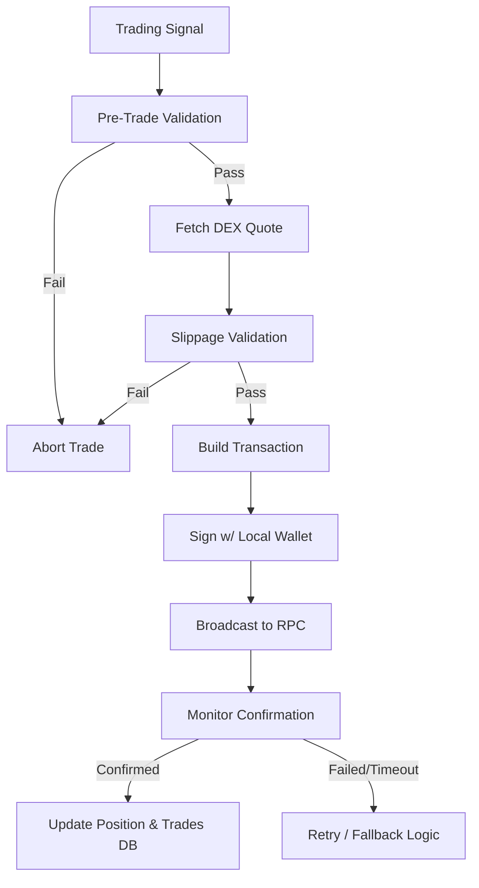

# MemeX — Execution Engine

> Dokumen ini mendefinisikan layer eksekusi (Execution Engine) yang bertanggung jawab menerjemahkan sinyal trading menjadi transaksi di blockchain.

---

## Table of Contents

- [1. Overview](#1-overview)
- [2. Execution Pipeline](#2-execution-pipeline)
- [3. Pre-Trade Validation](#3-pre-trade-validation)
- [4. Transaction Construction](#4-transaction-construction)
- [5. Slippage & Fee Management](#5-slippage--fee-management)
- [6. Error Handling & Retries](#6-error-handling--retries)
- [7. Blockchain Abstraction Layer](#7-blockchain-abstraction-layer)

---

## 1. Overview

Execution Engine bertugas mengeksekusi `BUY` atau `SELL` signal yang dihasilkan oleh Strategy Engine. Sistem ini adalah jembatan antara dunia off-chain (logic bot) dengan on-chain (DEX routers/aggregators).

Sistem harus aman, cepat, dan memiliki penanganan error yang kuat untuk menghadapi kegagalan jaringan RPC atau pergerakan harga yang tiba-tiba (MEV/sandwich attacks).

---

## 2. Execution Pipeline



---

## 3. Pre-Trade Validation

Sebelum menghubungi node RPC, sistem melakukan verifikasi lokal:

1. **Portfolio Limit Check:** Apakah total dana terbuka (open positions) melewati batas risiko akun?
2. **Duplicate Trade Check:** Apakah token ini sudah memiliki open position (untuk mencegah double-buy jika signal muncul berturut-turut).
3. **Wallet Balance Check:** Apakah saldo *native token* (misal SOL/ETH) cukup untuk jumlah trade + gas fee.
4. **Emergency Stop Check:** Apakah fitur "Kill Switch" sedang aktif? Jika ya, semua BUY signal diabaikan.

---

## 4. Transaction Construction

Untuk mencapai eksekusi yang optimal, sistem menggunakan aggregator (seperti Jupiter untuk Solana, atau 1inch untuk EVM) alih-alih menghubungi smart contract DEX tertentu secara langsung.

1. **Quote Request:** Meminta rute terbaik (best price route) ke Aggregator API.
2. **Build Tx:** Mengonversi route menjadi unsigned transaction payload.
3. **Sign Tx:** Menandatangani transaksi menggunakan private key (dikelola in-memory, tidak pernah di-log).

---

## 5. Slippage & Fee Management

Slippage sangat krusial di meme coin karena volatilitas tinggi.

1. **Dynamic Slippage:** Slippage tidak di-hardcode. Slippage base = 1%. Jika volatility token (dari Feature Engine) tinggi, slippage dinaikkan secara proporsional hingga maksimal `max_slippage_tolerance` (misal 5%).
2. **Gas Optimization (Priority Fees):** 
   - **Normal Trading:** Menggunakan network average priority fee.
   - **Emergency Sell (Stop Loss):** Membayar priority fee yang lebih tinggi (high/turbo) agar transaksi diutamakan oleh block builder, menghindari kerugian lebih dalam.

---

## 6. Error Handling & Retries

| Scenario | Action | Retry Policy |
|----------|--------|--------------|
| RPC Timeout | Ganti RPC endpoint, cek status TX. | Maks 3 kali, ganti RPC tiap coba. |
| Slippage Exceeded | Kalkulasi ulang Quote, naikkan toleransi jika masih dalam batas wajar. | Maks 2 kali. |
| Insufficient Balance | Turunkan nominal trade sebesar 5% dan coba lagi (hanya jika gagal karena gas estimation). | Maks 1 kali. |
| MEV Sandwich Attack | Jika gagal karena MEV, batalkan order (jangan diretry untuk menghindari sandwich susulan). | Tidak di-retry. |

---

## 7. Blockchain Abstraction Layer

Untuk mendukung multi-chain, kode eksekusi dienkapsulasi dalam antarmuka adapter.

```python
class BlockchainExecutionAdapter(ABC):
    @abstractmethod
    async def get_quote(self, token_in: str, token_out: str, amount: Decimal, slippage: float) -> Quote:
        pass

    @abstractmethod
    async def build_transaction(self, quote: Quote, wallet_address: str) -> UnsignedTx:
        pass

    @abstractmethod
    async def sign_and_broadcast(self, tx: UnsignedTx, private_key: str) -> str: # Returns tx_hash
        pass
        
    @abstractmethod
    async def wait_for_confirmation(self, tx_hash: str) -> TxResult:
        pass
```

Implementasi konkret nantinya berupa `SolanaJupiterAdapter` atau `EVMOneInchAdapter`.
