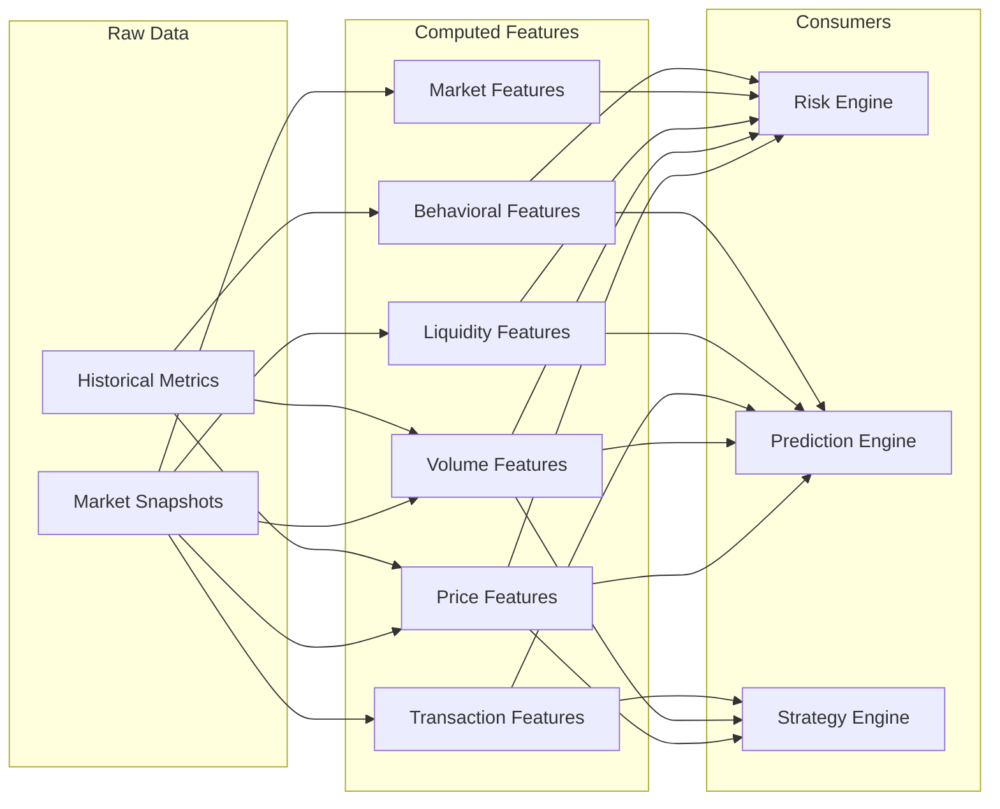
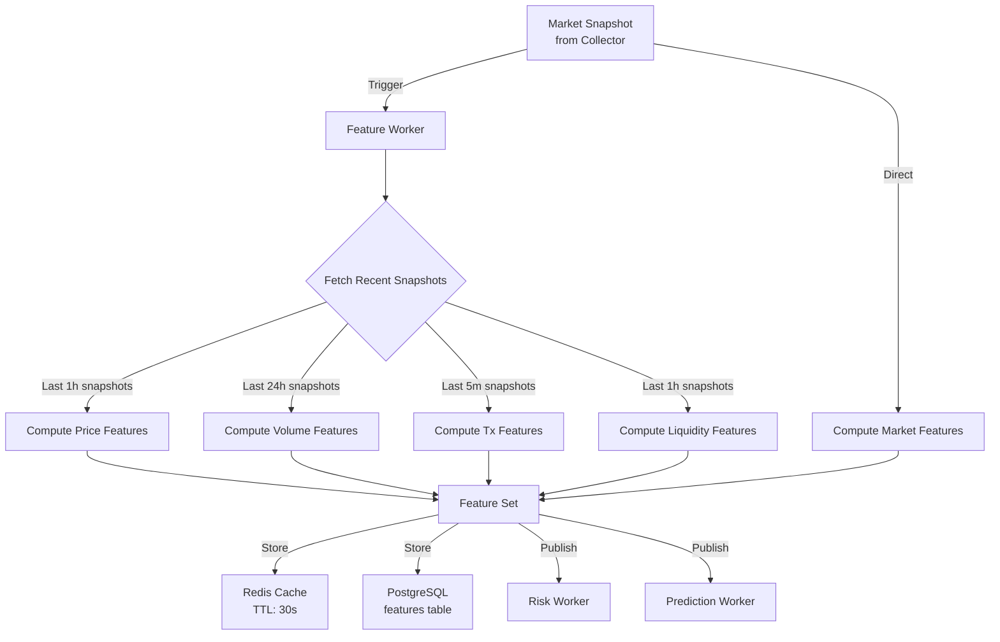

# MemeX — Feature Engineering

> Dokumen ini mendefinisikan semua computed features yang digunakan oleh risk engine, prediction engine, dan strategy engine.

---

## Table of Contents

- [1. Overview](#1-overview)
- [2. Price Features](#2-price-features)
- [3. Volume Features](#3-volume-features)
- [4. Transaction Features](#4-transaction-features)
- [5. Liquidity Features](#5-liquidity-features)
- [6. Market Features](#6-market-features)
- [7. Behavioral Features](#7-behavioral-features)
- [8. Feature Computation Pipeline](#8-feature-computation-pipeline)
- [9. Feature Store](#9-feature-store)

---

## 1. Overview

### Feature Categories



### Data Source per Feature

| Source | Availability | Features Supported |
|--------|-------------|-------------------|
| DEX Screener API (realtime) | ✅ Available | Price, Volume, Transaction, Liquidity, Market |
| Internal Historical Data (snapshots) | ✅ Available (self-collected) | All derived/computed features |
| On-chain Data (RPC/indexer) | ❌ Not yet | Behavioral features (whale, holder, developer) |

---

## 2. Price Features

| Feature | Formula | Timeframe | Source |
|---------|---------|-----------|--------|
| `return_1m` | `(price_now - price_1m_ago) / price_1m_ago` | 1 min | Computed from snapshots |
| `return_5m` | `(price_now - price_5m_ago) / price_5m_ago` | 5 min | DEX Screener `priceChange.m5` / 100 |
| `return_15m` | `(price_now - price_15m_ago) / price_15m_ago` | 15 min | Computed from snapshots |
| `return_1h` | `(price_now - price_1h_ago) / price_1h_ago` | 1 hour | DEX Screener `priceChange.h1` / 100 |
| `return_6h` | DEX Screener value | 6 hours | DEX Screener `priceChange.h6` / 100 |
| `return_24h` | DEX Screener value | 24 hours | DEX Screener `priceChange.h24` / 100 |
| `volatility_5m` | `std(returns) over last 5 minutes` (dari 10s snapshots) | 5 min | Computed |
| `volatility_1h` | `std(returns) over last 1 hour` | 1 hour | Computed |
| `high_low_range_1h` | `(high_1h - low_1h) / low_1h` | 1 hour | Computed from snapshots |
| `momentum_5m` | `return_5m - return_5m_prev` | 5 min | Computed (return acceleration) |
| `momentum_1h` | `return_1h - return_1h_prev` | 1 hour | Computed |
| `price_distance_from_high` | `(price_now - high_24h) / high_24h` | 24 hour | Computed |
| `price_distance_from_low` | `(price_now - low_24h) / low_24h` | 24 hour | Computed |

---

## 3. Volume Features

| Feature | Formula | Timeframe | Source |
|---------|---------|-----------|--------|
| `volume_1m` | Sum volume over last 1 minute | 1 min | Computed from snapshots |
| `volume_5m` | DEX Screener value | 5 min | DEX Screener |
| `volume_1h` | DEX Screener value | 1 hour | DEX Screener |
| `volume_24h` | DEX Screener value | 24 hours | DEX Screener |
| `volume_growth_5m` | `volume_5m_now / volume_5m_prev - 1` | 5 min vs prev 5 min | Computed |
| `volume_growth_1h` | `volume_1h_now / volume_1h_prev - 1` | 1h vs prev 1h | Computed |
| `volume_acceleration` | `volume_growth_5m - volume_growth_5m_prev` | 5 min | Computed |
| `volume_spike` | `volume_5m / avg_volume_5m_24h` | 5 min vs 24h avg | Computed |
| `volume_price_ratio` | `volume_24h / market_cap` | 24 hours | Computed |
| `volume_liquidity_ratio` | `volume_24h / liquidity_usd` | 24 hours | Computed |
| `relative_volume` | `volume_1h / avg_volume_1h_7d` | 1h vs 7-day avg | Computed |

**Volume Spike Interpretation:**

| `volume_spike` Value | Interpretation |
|---------------------|---------------|
| < 1.0 | Below average |
| 1.0 - 2.0 | Normal |
| 2.0 - 5.0 | Elevated activity |
| 5.0 - 10.0 | Significant spike |
| > 10.0 | Extreme spike — potential breakout or manipulation |

---

## 4. Transaction Features

| Feature | Formula | Timeframe | Source |
|---------|---------|-----------|--------|
| `buy_sell_ratio_5m` | `buys_5m / max(sells_5m, 1)` | 5 min | DEX Screener |
| `buy_sell_ratio_1h` | `buys_1h / max(sells_1h, 1)` | 1 hour | DEX Screener |
| `buy_sell_ratio_24h` | `buys_24h / max(sells_24h, 1)` | 24 hours | DEX Screener |
| `buy_pressure` | `buys_5m / (buys_5m + sells_5m)` | 5 min | Computed |
| `sell_pressure` | `sells_5m / (buys_5m + sells_5m)` | 5 min | Computed |
| `net_buy_pressure` | `buy_pressure - sell_pressure` | 5 min | Computed |
| `tx_velocity_5m` | `(buys_5m + sells_5m)` | 5 min | DEX Screener |
| `tx_velocity_1h` | `(buys_1h + sells_1h)` | 1 hour | DEX Screener |
| `tx_velocity_change` | `tx_velocity_5m_now / tx_velocity_5m_prev - 1` | 5 min | Computed |
| `avg_trade_size_5m` | `volume_5m / max(tx_velocity_5m, 1)` | 5 min | Computed |
| `buy_pressure_trend` | `buy_pressure_now - buy_pressure_prev` | 5 min | Computed |

---

## 5. Liquidity Features

| Feature | Formula | Timeframe | Source |
|---------|---------|-----------|--------|
| `liquidity_usd` | Current liquidity | Point-in-time | DEX Screener |
| `liquidity_change_5m` | `(liq_now - liq_5m_ago) / liq_5m_ago` | 5 min | Computed |
| `liquidity_change_1h` | `(liq_now - liq_1h_ago) / liq_1h_ago` | 1 hour | Computed |
| `liquidity_mcap_ratio` | `liquidity_usd / max(market_cap, 1)` | Point-in-time | Computed |
| `liquidity_volume_ratio` | `liquidity_usd / max(volume_24h, 1)` | Point-in-time | Computed |
| `liquidity_depth` | `liquidity_usd / max(market_cap, 1) * 100` | Point-in-time | Computed |

**Liquidity Health Interpretation:**

| `liquidity_mcap_ratio` | Interpretation |
|------------------------|---------------|
| > 0.10 | Healthy — deep liquidity |
| 0.05 - 0.10 | Moderate |
| 0.01 - 0.05 | Thin — slippage risk |
| < 0.01 | Dangerous — high slippage, potential rug |

---

## 6. Market Features

| Feature | Formula | Timeframe | Source |
|---------|---------|-----------|--------|
| `market_cap` | DEX Screener value | Point-in-time | DEX Screener |
| `fdv` | DEX Screener value | Point-in-time | DEX Screener |
| `mcap_fdv_ratio` | `market_cap / max(fdv, 1)` | Point-in-time | Computed |
| `pair_age_minutes` | `(now - pair_created_at) / 60` | Point-in-time | Computed |
| `pair_age_category` | Categorical (new/young/mature/old) | Point-in-time | Computed |
| `is_new_pair` | `pair_age_minutes < 60` | Point-in-time | Computed |

**Pair Age Categories:**

| Category | Age | Notes |
|----------|-----|-------|
| `new` | < 1 hour | Very high risk, limited data |
| `young` | 1-24 hours | High risk, building history |
| `mature` | 1-7 days | Moderate risk, sufficient data |
| `established` | > 7 days | Lower risk, good historical data |

---

## 7. Behavioral Features

> [!WARNING]
> Behavioral features membutuhkan **on-chain data** yang tidak tersedia melalui DEX Screener API. Fitur ini ditandai `[TBD]` dan akan diimplementasikan setelah integrasi dengan blockchain RPC/indexer.

| Feature | Deskripsi | Data Source | Status |
|---------|-----------|-------------|--------|
| `whale_buy_count` | Large buy transactions (> $10k) | On-chain | `[TBD]` |
| `whale_sell_count` | Large sell transactions (> $10k) | On-chain | `[TBD]` |
| `whale_net_flow` | Net whale buy - sell volume | On-chain | `[TBD]` |
| `holder_count` | Unique token holders | On-chain | `[TBD]` |
| `holder_growth_rate` | Rate of new holders | On-chain | `[TBD]` |
| `top10_holder_pct` | % supply held by top 10 | On-chain | `[TBD]` |
| `dev_wallet_pct` | % supply in dev/team wallets | On-chain | `[TBD]` |
| `dev_wallet_activity` | Recent dev wallet transfers | On-chain | `[TBD]` |
| `contract_verified` | Is contract source verified | Explorer API | `[TBD]` |
| `contract_renounced` | Is ownership renounced | On-chain | `[TBD]` |

### Proxy Features (Available Now)

Beberapa behavioral signals bisa di-approximate dari data yang tersedia:

| Proxy Feature | Approximation | Rationale |
|--------------|---------------|-----------|
| `whale_indicator` | `avg_trade_size_5m > 10 * avg_trade_size_24h` | Large trades indicate whale activity |
| `organic_growth_indicator` | `tx_velocity_change > 0 AND buy_sell_ratio < 3` | Gradual growth vs pump |
| `wash_trading_indicator` | `volume_24h > market_cap * 5 AND liquidity_mcap_ratio < 0.02` | Anomalous volume vs cap |

---

## 8. Feature Computation Pipeline

### 8.1 Pipeline Flow



### 8.2 Computation Dependencies

| Feature Set | Required Data | Min Snapshots Needed |
|-------------|--------------|---------------------|
| Price Features | Last 1h of snapshots | 6 (1 per 10s for 1 min) |
| Volume Features | Last 24h of snapshots/metrics | 1 snapshot + historical metrics |
| Tx Features | Last 5m of snapshots | 1 snapshot (ratios from API data) |
| Liquidity Features | Last 1h of snapshots | 2 (current + previous) |
| Market Features | Current snapshot only | 1 |
| Behavioral Features | On-chain data | `[TBD]` |

### 8.3 Cold Start Handling

Ketika token baru ditemukan, beberapa features belum bisa dihitung:

```
Token discovered
     ↓
First 5 minutes:
  - Only current snapshot features available
  - Historical features = NULL
  - volatility = NULL
  - volume_spike = NULL
     ↓
After 5 minutes:
  - 5m features available
     ↓
After 1 hour:
  - All standard features available
     ↓
After 24 hours:
  - 24h comparison features available
```

**Strategy:** Features yang belum tersedia di-set ke `NULL`. Risk engine dan prediction engine harus handle NULL features gracefully (use default/conservative values).

---

## 9. Feature Store

### 9.1 Storage Format

Features disimpan sebagai JSONB di tabel `features`:

```json
{
  "price": {
    "return_5m": 0.025,
    "return_1h": 0.15,
    "return_24h": 1.45,
    "volatility_5m": 0.003,
    "volatility_1h": 0.02,
    "momentum_5m": 0.01,
    "high_low_range_1h": 0.08
  },
  "volume": {
    "volume_5m": 45678.90,
    "volume_1h": 234567.89,
    "volume_growth_5m": 1.5,
    "volume_spike": 3.2,
    "volume_price_ratio": 0.15
  },
  "transactions": {
    "buy_sell_ratio_5m": 2.1,
    "buy_pressure": 0.68,
    "sell_pressure": 0.32,
    "tx_velocity_5m": 57,
    "avg_trade_size_5m": 801.38
  },
  "liquidity": {
    "liquidity_usd": 567890.12,
    "liquidity_change_1h": 0.02,
    "liquidity_mcap_ratio": 0.12,
    "liquidity_depth": 12.0
  },
  "market": {
    "market_cap": 4567890.12,
    "pair_age_minutes": 4320,
    "pair_age_category": "mature"
  },
  "metadata": {
    "computed_at": "2026-08-29T14:30:00Z",
    "snapshot_count": 6,
    "missing_features": ["whale_indicator"],
    "data_quality": "good"
  }
}
```

### 9.2 Feature Versioning

Ketika feature set berubah (tambah/ubah features), gunakan version field:

```json
{
  "feature_version": "1.0",
  "features": { ... }
}
```

Ini penting untuk ML training — model harus tahu feature version mana yang digunakan.
