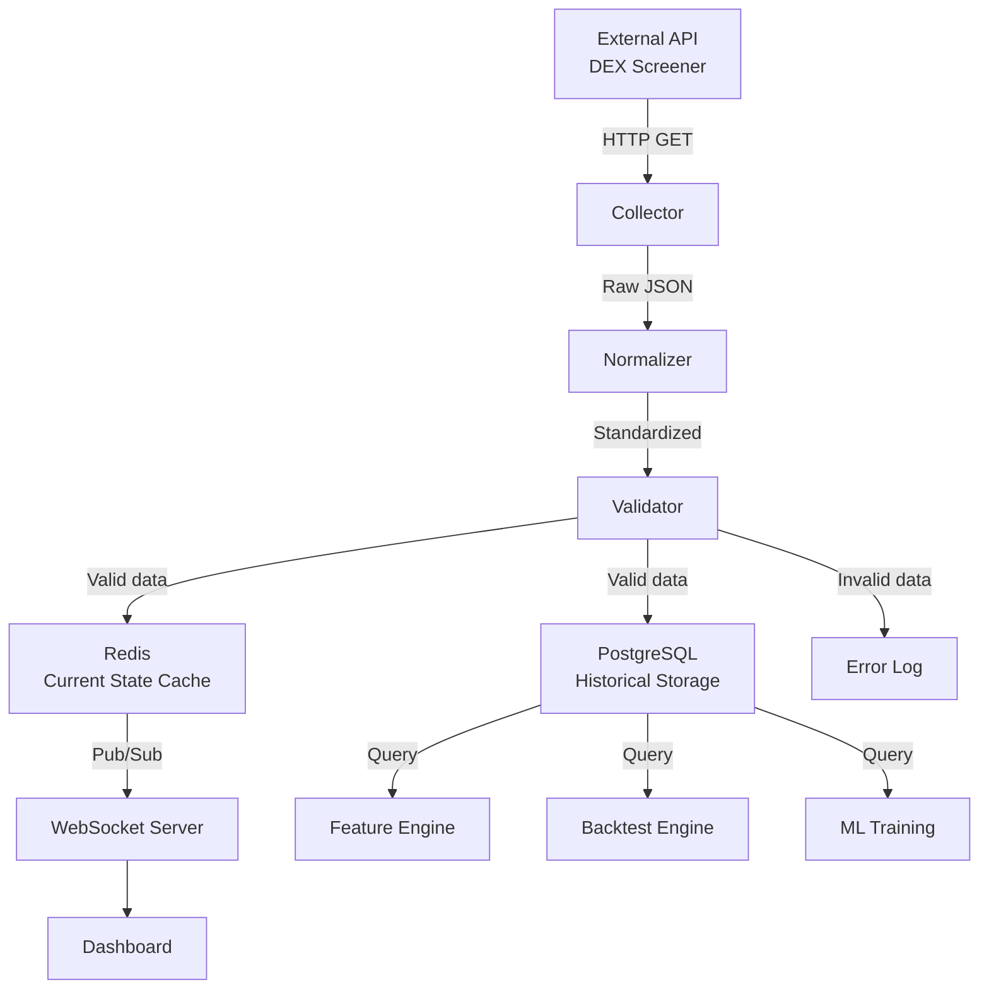
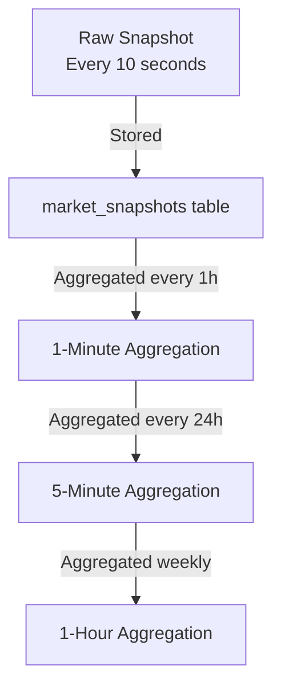

# MemeX — Market Data System

> Dokumen ini menjelaskan integrasi DEX Screener API, data pipeline, historical data strategy, dan retention policy.

---

## Table of Contents

- [1. External Data Source: DEX Screener API](#1-external-data-source-dex-screener-api)
- [2. Data Pipeline Architecture](#2-data-pipeline-architecture)
- [3. Market Data Fields](#3-market-data-fields)
- [4. Historical Data & Retention](#4-historical-data--retention)
- [5. Data Quality & Validation](#5-data-quality--validation)
- [6. Caching Strategy](#6-caching-strategy)
- [7. Execution Layer Abstraction](#7-execution-layer-abstraction)

---

## 1. External Data Source: DEX Screener API

### 1.1 Overview

DEX Screener menyediakan **market data** dan **discovery** dari 70+ DEX di 30+ blockchain. API ini adalah **read-only** — tidak dapat digunakan untuk melakukan transaksi.

```
DEX Screener = Market Data / Discovery
Blockchain / DEX / Aggregator = Trade Execution
```

Base URL: `https://api.dexscreener.com`

### 1.2 Relevant Endpoints

| Endpoint | Method | Deskripsi | Rate Limit |
|----------|--------|-----------|------------|
| `/latest/dex/search?q={query}` | GET | Search pairs by keyword | 60 req/min |
| `/latest/dex/pairs/{chainId}/{pairId}` | GET | Fetch pair data by chain & pair ID | 300 req/min |
| `/token-pairs/v1/{chainId}/{tokenAddress}` | GET | Get all pairs for a token address | 60 req/min |
| `/tokens/v1/{chainId}/{tokenAddresses}` | GET | Get token info (supports multiple, comma-separated) | 60 req/min |
| `/token-profiles/latest/v1` | GET | Latest token profiles | 60 req/min |
| `/token-boosts/latest/v1` | GET | Latest boosted tokens | 60 req/min |
| `/token-boosts/top/v1` | GET | Tokens with most active boosts | 60 req/min |
| `/orders/v1/{chainId}/{tokenAddress}` | GET | Get orders for a token | 60 req/min |

### 1.3 Data Available per Pair

DEX Screener pair response menyediakan data berikut:

```json
{
  "chainId": "solana",
  "dexId": "raydium",
  "url": "https://dexscreener.com/solana/...",
  "pairAddress": "...",
  "labels": ["v2"],
  "baseToken": {
    "address": "...",
    "name": "Token Name",
    "symbol": "TKN"
  },
  "quoteToken": {
    "address": "So11...wrappedSOL",
    "name": "Wrapped SOL",
    "symbol": "SOL"
  },
  "priceNative": "0.001234",
  "priceUsd": "0.1234",
  "txns": {
    "m5":  { "buys": 45, "sells": 12 },
    "h1":  { "buys": 320, "sells": 180 },
    "h6":  { "buys": 1200, "sells": 800 },
    "h24": { "buys": 5000, "sells": 3000 }
  },
  "volume": {
    "m5": 12345.67,
    "h1": 98765.43,
    "h6": 456789.12,
    "h24": 1234567.89
  },
  "priceChange": {
    "m5": 2.5,
    "h1": -1.3,
    "h6": 15.7,
    "h24": 45.2
  },
  "liquidity": {
    "usd": 567890.12,
    "base": 1000000,
    "quote": 5000
  },
  "fdv": 12345678.90,
  "marketCap": 9876543.21,
  "pairCreatedAt": 1700000000000,
  "info": {
    "imageUrl": "...",
    "websites": [...],
    "socials": [...]
  }
}
```

### 1.4 Data Mapping

| Category | DEX Screener Field | Internal Field | Available |
|----------|--------------------|----------------|-----------|
| **Price** | `priceUsd` | `price_usd` | ✅ |
| | `priceNative` | `price_native` | ✅ |
| | `priceChange.m5` | `price_change_5m` | ✅ |
| | `priceChange.h1` | `price_change_1h` | ✅ |
| | `priceChange.h6` | `price_change_6h` | ✅ |
| | `priceChange.h24` | `price_change_24h` | ✅ |
| | `priceChange.m1` | `price_change_1m` | ❌ (not in API) |
| | `priceChange.m15` | `price_change_15m` | ❌ (not in API) |
| **Volume** | `volume.m5` | `volume_5m` | ✅ |
| | `volume.h1` | `volume_1h` | ✅ |
| | `volume.h6` | `volume_6h` | ✅ |
| | `volume.h24` | `volume_24h` | ✅ |
| | `volume.m1` | `volume_1m` | ❌ |
| | `volume.m15` | `volume_15m` | ❌ |
| **Transactions** | `txns.m5.buys` | `buys_5m` | ✅ |
| | `txns.m5.sells` | `sells_5m` | ✅ |
| | `txns.h1.buys` | `buys_1h` | ✅ |
| | `txns.h1.sells` | `sells_1h` | ✅ |
| | `txns.h6.*` | `buys_6h`, `sells_6h` | ✅ |
| | `txns.h24.*` | `buys_24h`, `sells_24h` | ✅ |
| **Liquidity** | `liquidity.usd` | `liquidity_usd` | ✅ |
| | `liquidity.base` | `liquidity_base` | ✅ |
| | `liquidity.quote` | `liquidity_quote` | ✅ |
| **Market** | `marketCap` | `market_cap` | ✅ |
| | `fdv` | `fdv` | ✅ |
| | `pairCreatedAt` | `pair_created_at` | ✅ |
| | `chainId` | `chain_id` | ✅ |
| | `dexId` | `dex_id` | ✅ |
| | `pairAddress` | `pair_address` | ✅ |
| **Token** | `baseToken.address` | `token_address` | ✅ |
| | `baseToken.name` | `token_name` | ✅ |
| | `baseToken.symbol` | `token_symbol` | ✅ |

> [!NOTE]
> DEX Screener **tidak** menyediakan data granular 1m dan 15m secara langsung. Data ini dapat dihitung secara internal melalui periodic snapshot yang disimpan setiap 10 detik.

### 1.5 Data Limitations

| Data | Source | Ketersediaan |
|------|--------|-------------|
| Price, Volume, Txns, Liquidity | DEX Screener | ✅ Available |
| Buy/Sell volume (USD breakdown) | DEX Screener | ❌ Not available — hanya count, bukan volume per side |
| Whale activity | On-chain data | ❌ Perlu RPC/indexer |
| Holder count & distribution | On-chain data | ❌ Perlu RPC/indexer |
| Developer wallet activity | On-chain data | ❌ Perlu RPC/indexer |
| Contract verification | On-chain / explorer | ❌ Perlu explorer API |
| Token supply details | On-chain data | ❌ Perlu RPC |

---

## 2. Data Pipeline Architecture

### 2.1 Pipeline Flow



### 2.2 Component Responsibilities

#### Collector

```
Input:  API endpoint + parameters
Output: Raw JSON response
Logic:
  1. Check rate limit budget
  2. Make HTTP request with timeout
  3. Handle HTTP errors (4xx, 5xx)
  4. Return raw response or error
```

Konfigurasi:
- **Request timeout**: 10 seconds
- **Max retries**: 3
- **Retry delay**: exponential backoff (1s, 2s, 4s)
- **Circuit breaker**: open after 5 consecutive failures, half-open after 60s

#### Normalizer

```
Input:  Raw DEX Screener JSON
Output: Standardized MarketSnapshot object
Logic:
  1. Map DEX Screener fields → internal fields
  2. Convert types (string → Decimal for prices)
  3. Handle missing/null fields with defaults
  4. Calculate derived fields (e.g., buy_sell_ratio)
  5. Add metadata (collection_timestamp, source)
```

#### Validator

```
Input:  Normalized MarketSnapshot
Output: Validated MarketSnapshot or ValidationError
Rules:
  1. price_usd > 0
  2. volume_24h >= 0
  3. liquidity_usd >= 0
  4. market_cap >= 0
  5. buys + sells > 0 (active pair)
  6. pair_created_at is valid timestamp
  7. chain_id is supported
  8. No stale data (timestamp within acceptable window)
```

### 2.3 Collection Schedule

| Data Type | Interval | Trigger | Method |
|-----------|----------|---------|--------|
| Watched tokens (market data) | 10s | Scheduler | `/latest/dex/pairs/{chainId}/{pairId}` |
| New token discovery | 30s | Scheduler | `/token-profiles/latest/v1` |
| Trending/boosted tokens | 60s | Scheduler | `/token-boosts/top/v1` |
| Token search (on-demand) | On request | API/User | `/latest/dex/search?q=...` |

### 2.4 Rate Limit Management

```
Budget Allocation (per minute):

Token-related endpoints (60 req/min):
  - Discovery:       10 req/min
  - Token lookup:    20 req/min
  - Search:          10 req/min
  - Reserve buffer:  20 req/min

Pair endpoints (300 req/min):
  - Market data:    250 req/min
  - Reserve buffer:  50 req/min
```

**Adaptive strategy:**
- Track remaining budget per minute window
- Jika budget < 20%, reduce polling frequency
- Jika budget = 0, queue requests for next window
- Exponential backoff on 429 responses

---

## 3. Market Data Fields

### 3.1 Price Data

| Field | Source | Type | Deskripsi |
|-------|--------|------|-----------|
| `price_usd` | DEX Screener | Decimal | Current price in USD |
| `price_native` | DEX Screener | Decimal | Current price in native token |
| `price_change_5m` | DEX Screener | Float | Percentage change in 5 min |
| `price_change_1h` | DEX Screener | Float | Percentage change in 1 hour |
| `price_change_6h` | DEX Screener | Float | Percentage change in 6 hours |
| `price_change_24h` | DEX Screener | Float | Percentage change in 24 hours |
| `price_change_1m` | Computed | Float | Derived dari consecutive snapshots |
| `price_change_15m` | Computed | Float | Derived dari consecutive snapshots |

### 3.2 Volume Data

| Field | Source | Type | Deskripsi |
|-------|--------|------|-----------|
| `volume_5m` | DEX Screener | Decimal | Volume USD in 5 min |
| `volume_1h` | DEX Screener | Decimal | Volume USD in 1 hour |
| `volume_6h` | DEX Screener | Decimal | Volume USD in 6 hours |
| `volume_24h` | DEX Screener | Decimal | Volume USD in 24 hours |
| `volume_1m` | Computed | Decimal | Derived dari consecutive snapshots |
| `volume_15m` | Computed | Decimal | Derived dari consecutive snapshots |

### 3.3 Transaction Data

| Field | Source | Type | Deskripsi |
|-------|--------|------|-----------|
| `buys_5m` | DEX Screener | Integer | Buy transactions in 5 min |
| `sells_5m` | DEX Screener | Integer | Sell transactions in 5 min |
| `buys_1h` | DEX Screener | Integer | Buy transactions in 1 hour |
| `sells_1h` | DEX Screener | Integer | Sell transactions in 1 hour |
| `buys_24h` | DEX Screener | Integer | Buy transactions in 24 hours |
| `sells_24h` | DEX Screener | Integer | Sell transactions in 24 hours |
| `buy_sell_ratio_5m` | Computed | Float | `buys_5m / (buys_5m + sells_5m)` |
| `buy_sell_ratio_1h` | Computed | Float | `buys_1h / (buys_1h + sells_1h)` |

### 3.4 Liquidity Data

| Field | Source | Type | Deskripsi |
|-------|--------|------|-----------|
| `liquidity_usd` | DEX Screener | Decimal | Total liquidity in USD |
| `liquidity_base` | DEX Screener | Decimal | Liquidity in base token |
| `liquidity_quote` | DEX Screener | Decimal | Liquidity in quote token |
| `liquidity_change` | Computed | Float | % change dari snapshot sebelumnya |
| `liquidity_mcap_ratio` | Computed | Float | `liquidity_usd / market_cap` |

### 3.5 Market Data

| Field | Source | Type | Deskripsi |
|-------|--------|------|-----------|
| `market_cap` | DEX Screener | Decimal | Market capitalization |
| `fdv` | DEX Screener | Decimal | Fully diluted valuation |
| `pair_age_minutes` | Computed | Integer | Usia pair dalam menit |
| `chain_id` | DEX Screener | String | Blockchain identifier |
| `dex_id` | DEX Screener | String | DEX identifier |
| `pair_address` | DEX Screener | String | Pair contract address |

---

## 4. Historical Data & Retention

### 4.1 Snapshot Strategy



**Rekomendasi interval:**

| Level | Interval | Retention | Use Case |
|-------|----------|-----------|----------|
| Raw Snapshots | 10 seconds | 7 days | Realtime analysis, short-term features |
| 1-Minute Aggregation | 1 minute | 30 days | Feature engineering, recent backtesting |
| 5-Minute Aggregation | 5 minutes | 90 days | Backtesting, ML training |
| 1-Hour Aggregation | 1 hour | 1 year+ | Long-term analysis, model evaluation |

> [!IMPORTANT]
> **Recommendation**: Mulai dengan raw snapshots (10s) dan 5-minute aggregation. Tambahkan 1-minute jika dibutuhkan oleh feature engineering. 1-hour aggregation untuk long-term storage.

### 4.2 Aggregation Fields

Setiap aggregated record menyimpan:

```
- open_price      : Harga di awal interval
- close_price     : Harga di akhir interval
- high_price      : Harga tertinggi dalam interval
- low_price       : Harga terendah dalam interval
- total_volume    : Sum volume
- total_buys      : Sum buy transactions
- total_sells     : Sum sell transactions
- avg_liquidity   : Average liquidity
- snapshot_count  : Jumlah raw snapshots in interval
```

### 4.3 Storage Estimation

Asumsi: watch 200 tokens rata-rata, raw snapshot per 10 detik.

| Level | Records/day (per token) | Records/day (200 tokens) | Size/record | Daily Storage |
|-------|------------------------|--------------------------|-------------|---------------|
| Raw (10s) | 8,640 | 1,728,000 | ~500 bytes | ~825 MB |
| 1-Min | 1,440 | 288,000 | ~400 bytes | ~110 MB |
| 5-Min | 288 | 57,600 | ~400 bytes | ~22 MB |
| 1-Hour | 24 | 4,800 | ~400 bytes | ~1.8 MB |

**Total estimated monthly:**
- Raw (7 days retention): ~5.8 GB
- 1-Min (30 days retention): ~3.3 GB
- 5-Min (90 days retention): ~2.0 GB
- 1-Hour (permanent): ~55 MB/month

> [!NOTE]
> PostgreSQL dengan table partitioning (by date) direkomendasikan untuk manage retention efficiently. Expired partitions di-drop secara otomatis.

### 4.4 Retention Cleanup

Automated cleanup jobs via scheduler:

```
Daily at 03:00 UTC:
  1. Drop raw snapshot partitions older than 7 days
  2. Drop 1-min aggregation partitions older than 30 days
  3. Drop 5-min aggregation partitions older than 90 days
  4. VACUUM ANALYZE affected tables
  5. Log cleanup results
```

---

## 5. Data Quality & Validation

### 5.1 Validation Rules

| Rule | Action on Fail |
|------|---------------|
| `price_usd <= 0` | Reject, log warning |
| `volume < 0` | Reject, log error |
| `liquidity_usd < 0` | Reject, log error |
| `buys + sells == 0` (dalam 24h) | Flag as inactive, deprioritize |
| `market_cap == 0` and `price > 0` | Accept but flag |
| Data timestamp > 60s old | Accept but flag stale |
| Duplicate snapshot (same pair, same timestamp ±2s) | Skip, deduplicate |
| Price change > 1000% in 5min | Accept but flag anomaly |

### 5.2 Data Anomaly Detection

Flags yang ditambahkan pada snapshot:

```
is_stale         : Data collection delayed > 60s
is_anomaly       : Price/volume movement beyond 3σ
is_low_liquidity : liquidity_usd < $1,000
is_inactive      : 0 transactions dalam 1 hour
is_new_pair      : pair_age < 30 minutes
```

---

## 6. Caching Strategy

### 6.1 Redis Cache Design

| Key Pattern | Value | TTL | Purpose |
|-------------|-------|-----|---------|
| `market:{chain}:{pair}:current` | Latest MarketSnapshot JSON | 15s | Current price for dashboard |
| `market:{chain}:{pair}:features` | Computed features JSON | 30s | Feature cache |
| `market:{chain}:{pair}:risk` | Risk assessment JSON | 60s | Risk score cache |
| `market:{chain}:{pair}:prediction` | ML prediction JSON | 60s | Prediction cache |
| `scanner:new_pairs` | List of recently discovered pairs | 60s | Discovery cache |
| `scanner:trending` | List of trending pairs | 60s | Trending cache |
| `ratelimit:dexscreener:tokens` | Counter | 60s | Rate limit tracking |
| `ratelimit:dexscreener:pairs` | Counter | 60s | Rate limit tracking |

### 6.2 Cache Invalidation

- **TTL-based**: Primary invalidation mechanism. Stale data automatically expires.
- **Write-through**: When new market data arrives, update both Redis and PostgreSQL.
- **Manual flush**: Admin endpoint to clear specific caches if needed.

---

## 7. Execution Layer Abstraction

> [!IMPORTANT]
> DEX Screener **TIDAK** menyediakan execution capabilities. Trade execution memerlukan integrasi terpisah dengan blockchain/DEX/aggregator.

### 7.1 Separation of Concerns

```
┌──────────────────────────────────┐
│    Market Data (Read-Only)       │
│    Source: DEX Screener API      │
│    Purpose: Discovery + Analytics│
└──────────────────────────────────┘

┌──────────────────────────────────┐
│    Trade Execution (Write)       │
│    Source: DEX/Aggregator API    │
│    Purpose: BUY / SELL           │
└──────────────────────────────────┘
```

### 7.2 Future Execution Integrations

| Chain | Aggregator/DEX | Type | Status |
|-------|---------------|------|--------|
| Solana | Jupiter | Aggregator | `[TBD]` — Primary candidate |
| Solana | Raydium | DEX | Planned |
| Ethereum | 1inch | Aggregator | Planned |
| Ethereum | Uniswap | DEX | Planned |
| Base | Aerodrome | DEX | Planned |

> [!NOTE]
> Execution layer diimplementasikan melalui `ExecutionAdapter` abstract class. Lihat [architecture.md](architecture.md) untuk detail adapter pattern.
