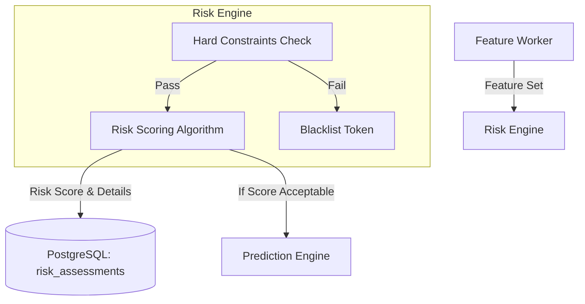

# MemeX — Token Risk Engine

> Dokumen ini mendefinisikan sistem scoring dan evaluasi risiko untuk meme coin.

---

## Table of Contents

- [1. Overview](#1-overview)
- [2. Risk Engine Architecture](#2-risk-engine-architecture)
- [3. Risk Categories & Scoring](#3-risk-categories--scoring)
- [4. Hard Constraints (Kill Switches)](#4-hard-constraints-kill-switches)
- [5. Output Format](#5-output-format)

---

## 1. Overview

Meme coin memiliki tingkat kegagalan (scam/rug pull/abandonment) yang sangat tinggi. Risk Engine bertugas untuk mengevaluasi token berdasarkan metrik on-chain maupun data DEX Screener untuk memberikan *Risk Score*.

Risk Engine berjalan sebelum Prediction Engine. Jika Risk Score terlalu tinggi (gagal constraint tertentu), token akan otomatis di-blacklist dan tidak diteruskan ke proses ML atau Trading.

---

## 2. Risk Engine Architecture



---

## 3. Risk Categories & Scoring

Skor dihitung dari 0 (Sangat Aman) hingga 100 (Sangat Berbahaya). Setiap kategori memiliki bobot.

### 3.1. Liquidity Risk (Bobot: 30%)
Risiko terkait kemampuan untuk masuk dan keluar pasar tanpa slippage berlebihan.
- **Liquidity USD:** Jika < $5,000 → Score 100. Jika > $100,000 → Score 0.
- **Liquidity/Market Cap Ratio:** Jika < 2% → Score 100. Jika > 10% → Score 0.

### 3.2. Manipulation Risk (Bobot: 30%)
Risiko wash trading atau manipulasi harga oleh sedikit dompet.
- **Buy/Sell Ratio Abnormal:** Jika Buys > Sells * 10 (indikasi wash trading) → Score 80.
- **Transaction Velocity Spike:** Lonjakan transaksi 1000% dalam 1 menit tanpa berita → Score 70.

### 3.3. Volatility Risk (Bobot: 20%)
Risiko pergerakan harga ekstrem.
- **High/Low Range 1h:** Jika jarak High ke Low dalam 1 jam > 300% → Score 80.

### 3.4. Behavioral Risk (On-chain, TBD) (Bobot: 20%)
- **Top 10 Holders %:** Jika > 80% supply dipegang top 10 (di luar LP/burn) → Score 90.
- **Contract Renounced:** Jika false → Score 60.

---

## 4. Hard Constraints (Kill Switches)

Ini adalah aturan absolut. Jika kondisi ini terpenuhi, token langsung masuk daftar hitam (`is_blacklisted = true`) dan sistem berhenti memprosesnya.

1. **Zero Liquidity:** `liquidity_usd < $1000` (atau threshold spesifik per chain).
2. **Honey Pot Detection:** Sells = 0 sementara Buys > 50 dalam 15 menit (hanya bisa beli, tidak bisa jual).
3. **Dead Coin:** Volume 24 jam < $500 setelah berumur > 3 hari.
4. **Suspicious Price Jump:** Kenaikan harga > 1,000,000% dalam 1 menit (bug API atau ekstrem manipulasi).

---

## 5. Output Format

Hasil evaluasi disimpan dalam database di tabel `risk_assessments`.

Contoh JSON response dari Risk Engine Worker:

```json
{
  "pair_id": "uuid-here",
  "assessed_at": "2026-08-29T15:00:00Z",
  "risk_score": 45,
  "risk_level": "MEDIUM",
  "details": {
    "liquidity_risk": 20,
    "volume_risk": 40,
    "price_risk": 50,
    "rug_pull_risk": 10,
    "reasons": [
      "Moderate liquidity ($45,000)",
      "High price volatility in last 1h (60% range)"
    ]
  },
  "is_blacklisted": false
}
```

- **LOW:** 0 - 30
- **MEDIUM:** 31 - 60
- **HIGH:** 61 - 85
- **CRITICAL:** 86 - 100
