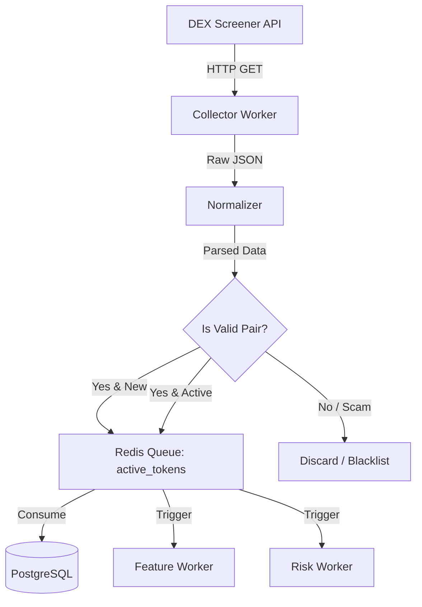

# MemeX — Token Discovery & Scanner System

> Dokumen ini menjelaskan rancangan sistem untuk mendeteksi token/pair baru dan memantau aktivitas pasar yang abnormal melalui Token Discovery System.

---

## Table of Contents

- [1. Overview](#1-overview)
- [2. System Architecture](#2-system-architecture)
- [3. Discovery Mechanisms](#3-discovery-mechanisms)
- [4. Scanning Strategies](#4-scanning-strategies)
- [5. Worker Lifecycle](#5-worker-lifecycle)
- [6. Caching & Rate Limiting](#6-caching--rate-limiting)
- [7. Error Handling](#7-error-handling)

---

## 1. Overview

Sistem Discovery & Scanner bertanggung jawab atas tahap paling awal dalam pipeline trading MemeX. Sistem ini tidak melakukan trade, melainkan mencari "sinyal" dari pasar berupa token baru, lonjakan volume, atau pergerakan harga yang menarik untuk selanjutnya dianalisis oleh Risk Engine dan Prediction Engine.

**Goals:**
- Menemukan pair baru di DEX secepat mungkin.
- Mendeteksi momentum (volume spike, rapid price changes) pada pair yang sudah ada.
- Menghindari rate limit dari data provider (DEX Screener).
- Memisahkan tugas discovery dari tugas analisis dan eksekusi.

---

## 2. System Architecture

---

## 3. Discovery Mechanisms

Sistem menggunakan beberapa endpoint DEX Screener untuk tujuan yang berbeda.

### 3.1. New Pairs Discovery (Endpoint: `/token-profiles/latest/v1`)
Mencari token profiles terbaru yang di-publish. Ini adalah sumber utama untuk token yang benar-benar baru.

### 3.2. Search by Chain (Endpoint: `/search?q={chain_id}`)
Secara periodik melakukan pencarian berdasarkan blockchain (misal: Solana, Base) untuk menemukan token trending di chain tersebut yang mungkin terlewat dari endpoint "latest".

### 3.3. Monitored Tokens Polling (Endpoint: `/tokens/{tokenAddresses}`)
Sistem menyimpan daftar token "active/watched" (dari `tokens.is_watched = true`). Scanner worker akan melakukan bulk query untuk mendapatkan snapshot terbaru dari token-token ini.

---

## 4. Scanning Strategies

Karena DEX Screener memiliki rate limit (maks 300 requests per menit), strategi scanning harus dioptimalkan.

### 4.1. Polling Intervals

| Target | Interval | Tujuan |
|--------|----------|--------|
| New Profiles | 10 seconds | Mendapatkan token yang baru rilis. |
| Monitored Active | 30 seconds | Update harga token yang masuk watchlist. |
| Top Trending | 5 minutes | Mendapatkan token yang tiba-tiba trending. |

### 4.2. Watchlist Management

Token yang dipantau (watched) akan dibuang dari active polling jika:
- Umur token > 7 hari dan volume 24h < $10k (Mati).
- Terdeteksi sebagai scam/rug pull oleh Risk Engine (`is_blacklisted = true`).

---

## 5. Worker Lifecycle

Sistem menggunakan **ARQ** (asyncio + Redis) untuk workers.

### 5.1. `DiscoveryWorker` (Cron Job)
- Berjalan setiap X detik.
- Menarik data dari endpoint DEX Screener.
- Meneruskan raw data ke `NormalizationTask`.

### 5.2. `NormalizationTask`
- Mem-parsing JSON dari DEX Screener menjadi Pydantic models.
- Melakukan basic filtering (contoh: discard jika liquidity < $1k).
- Menyimpan ke database (insert ke `tokens` dan `pairs` jika belum ada).
- Meneruskan ke `SnapshotTask`.

### 5.3. `SnapshotTask`
- Menyimpan state market terkini ke `market_snapshots`.
- Jika perubahan signifikan terdeteksi (volume/price spike), publish event ke queue Redis agar di-process oleh `FeatureWorker`.

---

## 6. Caching & Rate Limiting

Untuk menjaga stabilitas sistem dan tidak terkena blokir dari DEX Screener:

1. **Redis Cache:** Hasil query DEX Screener disimpan di Redis dengan TTL 10 detik. Jika dua worker secara bersamaan mencoba request data token yang sama, satu akan mengambil dari cache.
2. **Rate Limiter:** Menggunakan Token Bucket algorithm di sisi HTTP Client (misal `httpx` + custom transport) untuk membatasi maksimal 280 requests per menit (buffer 20 request dari limit 300).
3. **Bulk Request:** Maksimal menggunakan bulk query. DEX Screener mengizinkan pengiriman hingga 30 token addresses per request ke endpoint `/tokens/{addresses}`.

---

## 7. Error Handling

1. **HTTP 429 Too Many Requests:**
   - Worker akan melakukan exponential backoff.
   - Circuit breaker aktif, menunda semua HTTP request ke DEX Screener selama 30 detik.
2. **HTTP 5xx Server Error (DEX Screener Down):**
   - Fallback ke mode stand-by.
   - Memberikan alert log (ke Discord/Slack) bahwa data source down.
   - Tidak melakukan paper trading atau live trading selama data stale.
3. **Data Anomaly:**
   - Jika `price_change_5m` > 10,000%, flag sebagai data invalid dan tidak teruskan ke ML model kecuali diverifikasi.
