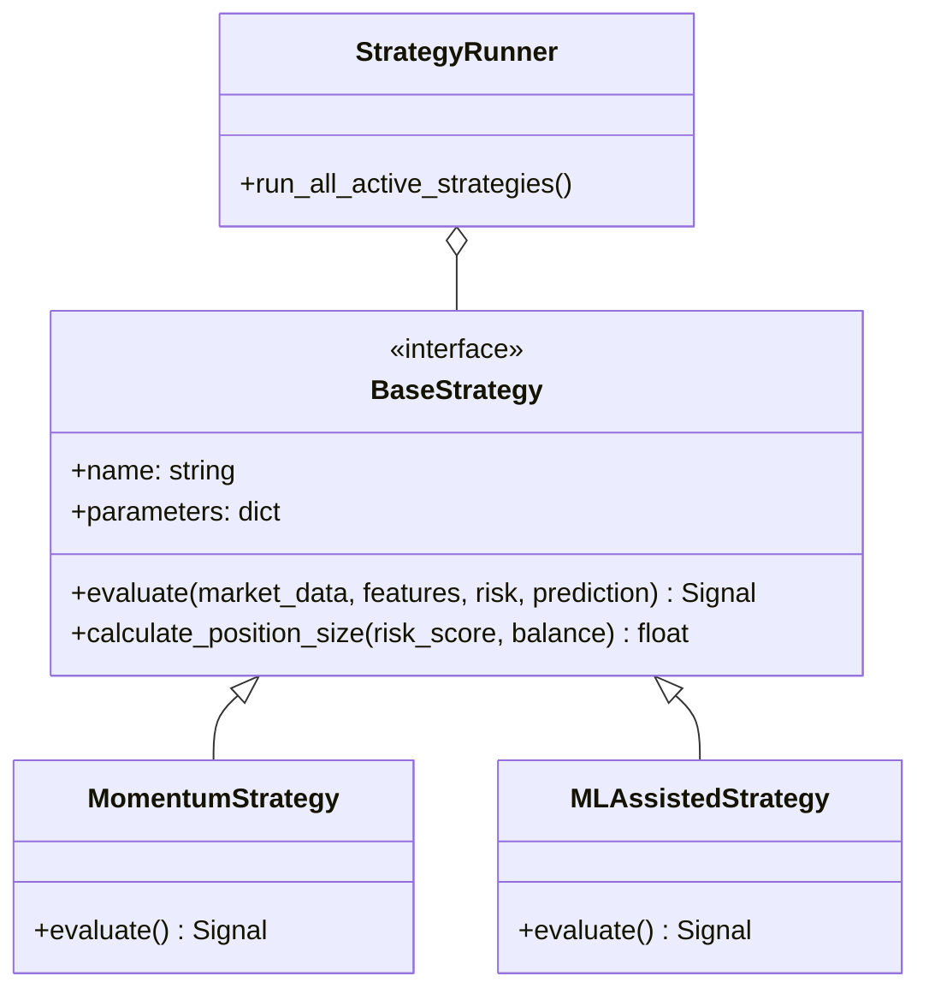

# MemeX — Strategy Engine

> Dokumen ini menjelaskan arsitektur Strategy Engine, tempat logika trading didefinisikan, dievaluasi, dan menghasilkan sinyal trading.

---

## Table of Contents

- [1. Overview](#1-overview)
- [2. Strategy Architecture](#2-strategy-architecture)
- [3. Core Components](#3-core-components)
- [4. Built-in Strategies](#4-built-in-strategies)
- [5. Signal Generation](#5-signal-generation)
- [6. Position Sizing Logic](#6-position-sizing-logic)

---

## 1. Overview

Strategy Engine menjembatani gap antara data (features & predictions) dengan eksekusi (BUY/SELL). Strategy menentukan **kapan** harus masuk pasar, **kapan** harus keluar, dan **berapa banyak** modal yang dialokasikan, berdasarkan risk preference dan kondisi pasar.

**Prinsip Utama:**
- Strategy harus bersifat modular dan tidak di-hardcode.
- Harus dapat menerima input dari Risk Engine dan Prediction Engine.
- Menghasilkan Trading Signal yang distandardisasi.

---

## 2. Strategy Architecture



---

## 3. Core Components

### 3.1. Interface `BaseStrategy`
Semua strategi harus mewarisi class `BaseStrategy` yang memiliki method wajib:
- `evaluate(...)`: Mengembalikan objek `Signal` (BUY/SELL/HOLD/SKIP).
- `calculate_position_size(...)`: Menghitung ukuran posisi (dalam persentase modal atau nominal).

### 3.2. Parameters Configuration
Setiap strategi memiliki JSON-based parameters yang bisa diubah via dashboard tanpa perlu mengubah kode.
Contoh parameter:
```json
{
  "min_volume_24h": 50000,
  "min_price_change_5m": 0.05,
  "max_risk_score": 50,
  "take_profit_pct": 0.20,
  "stop_loss_pct": 0.10
}
```

---

## 4. Built-in Strategies

### 4.1. Pure Momentum Strategy
Strategi klasikal yang mencari koin yang sedang breakout tanpa peduli prediksi ML.
- **Entry Condition:** `price_change_5m > 5%` AND `volume_spike > 3.0` AND `buy_sell_ratio > 1.5`.
- **Exit Condition:** Trailing stop 10%.

### 4.2. ML-Assisted Sniper (Default)
Menggabungkan momentum dengan prediksi ML.
- **Entry Condition:** `prediction.probability > 0.65` (untuk target +15% dalam 15m) AND `risk_score < 40`.
- **Exit Condition:** Fixed TP 15%, SL 10%, atau jika model memprediksi penurunan probabilitas ke bawah 0.40.

### 4.3. Mean Reversion (Dip Buyer)
Mencari koin fundamental bagus yang baru saja crash (overreaction).
- **Entry Condition:** `price_change_15m < -20%` AND `liquidity_usd > 100000` AND `buy_pressure > 0.6` (mulai ada buyer).
- **Exit Condition:** Rebound ke VWAP atau +10%.

---

## 5. Signal Generation

Setiap evaluasi strategi menghasilkan **Signal**.

Contoh Signal Object:
```json
{
  "pair_id": "uuid",
  "strategy_id": "ml_sniper_v1",
  "signal_type": "BUY",
  "confidence": 0.72,
  "risk_score_at_time": 35,
  "recommended_size": 0.05,
  "target_tp": 0.0012,
  "target_sl": 0.0009,
  "reasons": [
    "ML Probability is 72%",
    "Risk is acceptable (35/100)",
    "Volume spike detected (4.5x)"
  ],
  "timestamp": "2026-08-29T15:10:00Z"
}
```

---

## 6. Position Sizing Logic

MemeX tidak menggunakan fixed amount (misal "selalu beli $100"), melainkan dinamis berbasis risiko (Kelly Criterion versi yang disederhanakan).

**Formula Sederhana:**
```text
Base Allocation = 2% of Total Balance
Risk Modifier = (100 - risk_score) / 100
Confidence Modifier = ML Probability (0.5 to 1.0)

Final Size = Base Allocation * Risk Modifier * Confidence Modifier
```

**Contoh:**
- Balance: $1,000
- Base Alloc: $20
- Risk Score 30 (Modifier = 0.7)
- Probability 80% (Modifier = 0.8)
- Final Trade Size = $20 * 0.7 * 0.8 = **$11.20**
